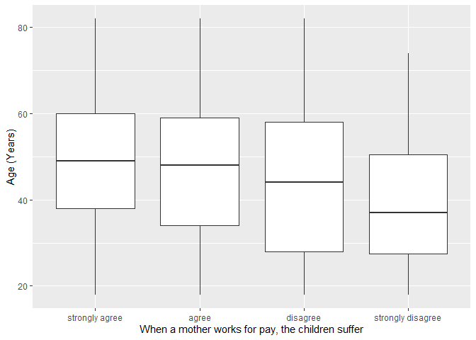
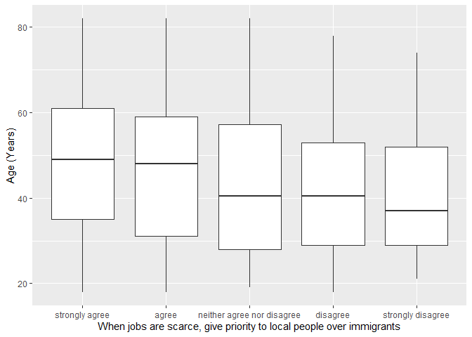

## Introduction

This is the report for the analysis on the [European Value Study (EVS) from 2017](https://search.gesis.org/research_data/ZA7500) which is a survey research program on how Europeans in Albania think about family, work, religion, politics, and society. We are mainly interested in Europeans thoughts on two questions:

1. When a mother works for pay, do Europeans think the children suffer?
2. When jobs are scarce, do Europeans think employers should give priority to local people over immigrants?

## Descriptives of variables

In the following table, the variables are:

1. `v72` represents the first question of interest (1-strongly agree, 2-agree, 3-disagree, or 4-strongly disagree)
2. `v80` represents the second question of interest (1-strongly agree, 2-agree, 3-neither agree nor disagree, 4-disagree, or 5-strongly disagree)
3. `sex` (1-male or 2-female)
4. `age` (years)
5. `education` (1-lower, 2-medium, or 3-higher)

-----------------------------------------------
      v72             v80             age      
--------------- --------------- ---------------
 Min.  :1.000    Min.  :1.000    Min.  :18.00  

 1st Qu.:2.000   1st Qu.:1.000   1st Qu.:32.00 

 Median :2.000   Median :2.000   Median :46.00 

  Mean :2.275     Mean :2.015     Mean :45.66  

 3rd Qu.:3.000   3rd Qu.:2.000   3rd Qu.:58.00 

 Max.  :4.000    Max.  :5.000    Max.  :82.00  
-----------------------------------------------

Table: Descriptive table for continuous variables

Table: Descriptive table for categorical variables

|Education | Sex|  Freq |
|:---------|---:|:------|
|Lower     |   M|200.00 |
|Medium    |   M|243.00 |
|Higher    |   M| 82.00 |
|Lower     |   F|439.00 |
|Medium    |   F|327.00 |
|Higher    |   F|126.00 |

## Graphs

Boxplot for first question of interest (v72)

Boxplot for second question of interest (v80)

## Regression Analysis

### Model: v72 ~ age + $\sqrt{\text{age}}$ + sex + education

--------------------------------------------------------------------
        &nbsp;          Estimate   Std. Error   t value   Pr(>|t|)  
---------------------- ---------- ------------ --------- -----------
   **(Intercept)**        3.8        0.589       6.451    1.528e-10 

       **age**          0.02739     0.01411      1.942     0.05234  

    **sqrt(age)**       -0.4314      0.1843     -2.341     0.01936  

    **sex-female**      0.01199     0.04481     0.2675     0.7891   

 **education-medium**   0.09755     0.04637      2.103     0.0356   

 **education-higher**    0.2876     0.06436      4.469    8.469e-06 
--------------------------------------------------------------------

---------------------------------------------------------------
 Observations   Residual Std. Error    $R^2$    Adjusted $R^2$ 
-------------- --------------------- --------- ----------------
     1417             0.7931          0.03548      0.03206     
---------------------------------------------------------------

Table: Fitting linear model: v72 ~ age + sqrt(age) + sex + education

The coefficient estimate for `sex` is 0.0119862 which means that the effect of a female respondent compared to a male is positive. The corresponding $p$-value is 0.7891269 which is greater than or equal to 0.05. Thus, `sex` is not significant in the model.

### Model: v80 ~ age + $\sqrt{\text{age}}$ + sex + education

--------------------------------------------------------------------
        &nbsp;          Estimate   Std. Error   t value   Pr(>|t|)  
---------------------- ---------- ------------ --------- -----------
   **(Intercept)**       1.691       0.8045      2.103     0.03568  

       **age**          -0.0183     0.01927      -0.95     0.3423   

    **sqrt(age)**        0.153       0.2517      0.608     0.5433   

    **sex-female**      0.05395      0.0612     0.8816     0.3781   

 **education-medium**    0.1348     0.06333      2.128     0.03354  

 **education-higher**    0.373       0.0879      4.244    2.343e-05 
--------------------------------------------------------------------

---------------------------------------------------------------
 Observations   Residual Std. Error    $R^2$    Adjusted $R^2$ 
-------------- --------------------- --------- ----------------
     1417              1.083          0.02773      0.02428     
---------------------------------------------------------------

Table: Fitting linear model: v80 ~ age + sqrt(age) + sex + education

The coefficient estimate for `sex` is 0.0539527 which means that the effect of a female respondent compared to a male is positive. The corresponding $p$-value is 0.37813 which is greater than or equal to 0.05. Thus, `sex` is not significant in the model.

