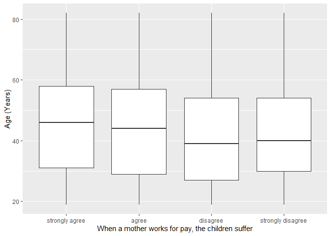
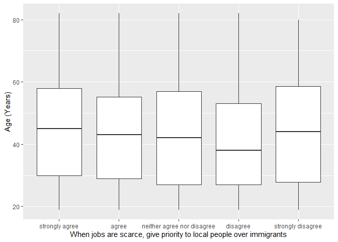

## Introduction

This is the report for the analysis on the [European Value Study (EVS) from 2017](https://search.gesis.org/research_data/ZA7500) which is a survey research program on how Europeans in Armenia think about family, work, religion, politics, and society. We are mainly interested in Europeans thoughts on two questions:

1. When a mother works for pay, do Europeans think the children suffer?
2. When jobs are scarce, do Europeans think employers should give priority to local people over immigrants?

## Descriptives of variables

In the following table, the variables are:

1. `v72` represents the first question of interest (1-strongly agree, 2-agree, 3-disagree, or 4-strongly disagree)
2. `v80` represents the second question of interest (1-strongly agree, 2-agree, 3-neither agree nor disagree, 4-disagree, or 5-strongly disagree)
3. `sex` (1-male or 2-female)
4. `age` (years)
5. `education` (1-lower, 2-medium, or 3-higher)

-----------------------------------------------
      v72             v80             age      
--------------- --------------- ---------------
 Min.  :1.000    Min.  :1.000    Min.  :19.00  

 1st Qu.:1.000   1st Qu.:1.000   1st Qu.:29.00 

 Median :2.000   Median :2.000   Median :43.00 

  Mean :2.076     Mean :2.033     Mean :44.43  

 3rd Qu.:3.000   3rd Qu.:3.000   3rd Qu.:57.00 

 Max.  :4.000    Max.  :5.000    Max.  :82.00  
-----------------------------------------------

Table: Descriptive table for continuous variables

Table: Descriptive table for categorical variables

|Education | Sex|   Freq|
|:---------|---:|------:|
|Lower     |   M|  54.00|
|Medium    |   M| 358.00|
|Higher    |   M| 260.00|
|Lower     |   F|  69.00|
|Medium    |   F| 440.00|
|Higher    |   F| 299.00|

## Graphs

Boxplot for first question of interest (v72)

Boxplot for second question of interest (v80)

## Regression Analysis

### Model: v72 ~ age + $\sqrt{\text{age}}$ + sex + education

--------------------------------------------------------------------
        &nbsp;          Estimate   Std. Error   t value   Pr(>|t|)  
---------------------- ---------- ------------ --------- -----------
   **(Intercept)**       2.412       0.5731      4.21     2.713e-05 

       **age**          0.003525    0.01356      0.26      0.7949   

    **sqrt(age)**       -0.0997      0.1794     -0.5557    0.5785   

    **sex-female**       0.1237     0.04446      2.782    0.005468  

 **education-medium**   0.08671     0.08462      1.025     0.3057   

 **education-higher**    0.1186     0.08826      1.344     0.1792   
--------------------------------------------------------------------

---------------------------------------------------------------
 Observations   Residual Std. Error    $R^2$    Adjusted $R^2$ 
-------------- --------------------- --------- ----------------
     1480              0.851          0.01372      0.01037     
---------------------------------------------------------------

Table: Fitting linear model: v72 ~ age + sqrt(age) + sex + education

The coefficient estimate for `sex` is 0.1237015 which means that the effect of a female respondent compared to a male is positive. The corresponding $p$-value is 0.005468 which is smaller than 0.05. Thus, `sex` is significant in the model.

### Model: v80 ~ age + $\sqrt{\text{age}}$ + sex + education

--------------------------------------------------------------------
        &nbsp;          Estimate   Std. Error   t value   Pr(>|t|)  
---------------------- ---------- ------------ --------- -----------
   **(Intercept)**       3.234       0.7393      4.375    1.302e-05 

       **age**          0.02405     0.01749      1.375     0.1694   

    **sqrt(age)**       -0.3693      0.2315     -1.596     0.1108   

    **sex-female**       0.1557     0.05736      2.715    0.006713  

 **education-medium**   0.04525      0.1092     0.4145     0.6786   

 **education-higher**   0.09372      0.1139     0.8231     0.4106   
--------------------------------------------------------------------

---------------------------------------------------------------
 Observations   Residual Std. Error    $R^2$    Adjusted $R^2$ 
-------------- --------------------- --------- ----------------
     1480              1.098          0.01045      0.00709     
---------------------------------------------------------------

Table: Fitting linear model: v80 ~ age + sqrt(age) + sex + education

The coefficient estimate for `sex` is 0.1557035 which means that the effect of a female respondent compared to a male is positive. The corresponding $p$-value is 0.0067133 which is smaller than 0.05. Thus, `sex` is significant in the model.

