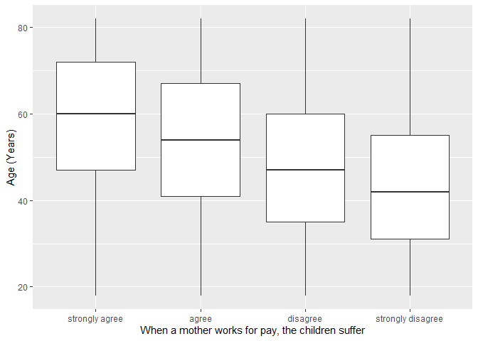
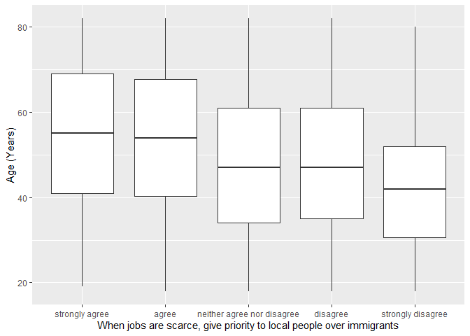

## Introduction

This is the report for the analysis on the [European Value Study (EVS) from 2017](https://search.gesis.org/research_data/ZA7500) which is a survey research program on how Europeans in Austria think about family, work, religion, politics, and society. We are mainly interested in Europeans thoughts on two questions:

1. When a mother works for pay, do Europeans think the children suffer?
2. When jobs are scarce, do Europeans think employers should give priority to local people over immigrants?

## Descriptives of variables

In the following table, the variables are:

1. `v72` represents the first question of interest (1-strongly agree, 2-agree, 3-disagree, or 4-strongly disagree)
2. `v80` represents the second question of interest (1-strongly agree, 2-agree, 3-neither agree nor disagree, 4-disagree, or 5-strongly disagree)
3. `sex` (1-male or 2-female)
4. `age` (years)
5. `education` (1-lower, 2-medium, or 3-higher)

----------------------------------------------
     v72             v80             age      
-------------- --------------- ---------------
 Min.  :1.00    Min.  :1.000    Min.  :18.00  

 1st Qu.:2.00   1st Qu.:2.000   1st Qu.:37.00 

 Median :2.00   Median :2.000   Median :50.00 

  Mean :2.54     Mean :2.597     Mean :50.74  

 3rd Qu.:3.00   3rd Qu.:4.000   3rd Qu.:65.00 

 Max.  :4.00    Max.  :5.000    Max.  :82.00  
----------------------------------------------

Table: Descriptive table for continuous variables

Table: Descriptive table for categorical variables

|Education | Sex|   Freq|
|:---------|---:|------:|
|Lower     |   M|  77.00|
|Medium    |   M| 493.00|
|Higher    |   M| 132.00|
|Lower     |   F| 145.00|
|Medium    |   F| 587.00|
|Higher    |   F| 133.00|

## Graphs

Boxplot for first question of interest (v72)

Boxplot for second question of interest (v80)

## Regression Analysis

### Model: v72 ~ age + $\sqrt{\text{age}}$ + sex + education

--------------------------------------------------------------------
        &nbsp;          Estimate   Std. Error   t value   Pr(>|t|)  
---------------------- ---------- ------------ --------- -----------
   **(Intercept)**       2.737       0.6356      4.306    1.764e-05 

       **age**          -0.01275    0.01406     -0.9069    0.3646   

    **sqrt(age)**       0.01468      0.193      0.07603    0.9394   

    **sex-female**       0.1595     0.04348      3.668    0.0002529 

 **education-medium**    0.2501     0.06624      3.775    0.000166  

 **education-higher**    0.511      0.08171      6.254    5.145e-10 
--------------------------------------------------------------------

---------------------------------------------------------------
 Observations   Residual Std. Error    $R^2$    Adjusted $R^2$ 
-------------- --------------------- --------- ----------------
     1567             0.8525          0.09185      0.08894     
---------------------------------------------------------------

Table: Fitting linear model: v72 ~ age + sqrt(age) + sex + education

The coefficient estimate for `sex` is 0.1594751 which means that the effect of a female respondent compared to a male is positive. The corresponding $p$-value is 2.5286381\times 10^{-4} which is smaller than 0.05. Thus, `sex` is significant in the model.

### Model: v80 ~ age + $\sqrt{\text{age}}$ + sex + education

--------------------------------------------------------------------
        &nbsp;          Estimate   Std. Error   t value   Pr(>|t|)  
---------------------- ---------- ------------ --------- -----------
   **(Intercept)**       2.221       0.9428      2.356     0.01861  

       **age**          -0.04138    0.02085     -1.985     0.04737  

    **sqrt(age)**        0.3405      0.2864      1.189     0.2346   

    **sex-female**       0.1068      0.0645      1.656     0.09797  

 **education-medium**   -0.06667    0.09826     -0.6785    0.4976   

 **education-higher**    0.4401      0.1212      3.631    0.0002916 
--------------------------------------------------------------------

---------------------------------------------------------------
 Observations   Residual Std. Error    $R^2$    Adjusted $R^2$ 
-------------- --------------------- --------- ----------------
     1567              1.265          0.07309      0.07012     
---------------------------------------------------------------

Table: Fitting linear model: v80 ~ age + sqrt(age) + sex + education

The coefficient estimate for `sex` is 0.1067891 which means that the effect of a female respondent compared to a male is positive. The corresponding $p$-value is 0.0979714 which is greater than or equal to 0.05. Thus, `sex` is not significant in the model.

