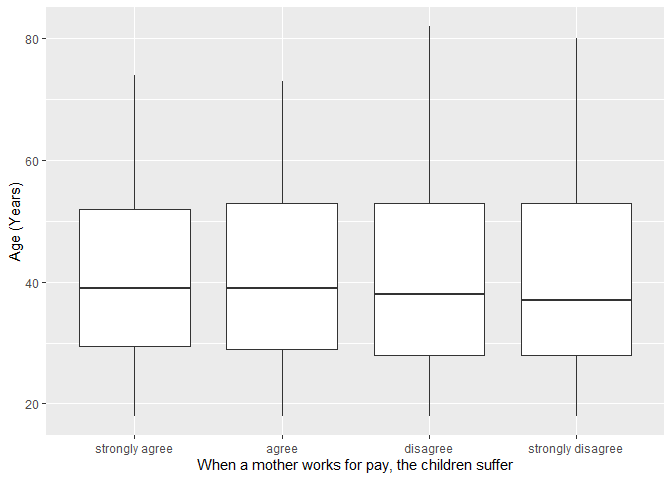
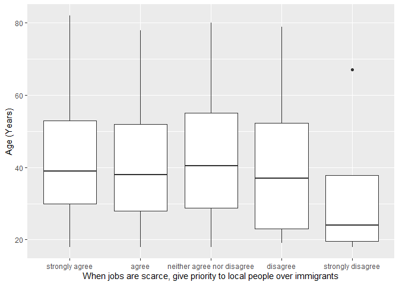

## Introduction

This is the report for the analysis on the [European Value Study (EVS) from 2017](https://search.gesis.org/research_data/ZA7500) which is a survey research program on how Europeans in Azerbaijan think about family, work, religion, politics, and society. We are mainly interested in Europeans thoughts on two questions:

1. When a mother works for pay, do Europeans think the children suffer?
2. When jobs are scarce, do Europeans think employers should give priority to local people over immigrants?

## Descriptives of variables

In the following table, the variables are:

1. `v72` represents the first question of interest (1-strongly agree, 2-agree, 3-disagree, or 4-strongly disagree)
2. `v80` represents the second question of interest (1-strongly agree, 2-agree, 3-neither agree nor disagree, 4-disagree, or 5-strongly disagree)
3. `sex` (1-male or 2-female)
4. `age` (years)
5. `education` (1-lower, 2-medium, or 3-higher)

-----------------------------------------------
      v72             v80             age      
--------------- --------------- ---------------
 Min.  :1.000    Min.  :1.000    Min.  :18.00  

 1st Qu.:1.000   1st Qu.:1.000   1st Qu.:29.00 

 Median :2.000   Median :1.000   Median :39.00 

  Mean :2.177     Mean :1.559     Mean :40.76  

 3rd Qu.:3.000   3rd Qu.:2.000   3rd Qu.:53.00 

 Max.  :4.000    Max.  :5.000    Max.  :82.00  
-----------------------------------------------

Table: Descriptive table for continuous variables

Table: Descriptive table for categorical variables

|Education | Sex|   Freq|
|:---------|---:|------:|
|Lower     |   M|  40.00|
|Medium    |   M| 665.00|
|Higher    |   M| 153.00|
|Lower     |   F|  94.00|
|Medium    |   F| 664.00|
|Higher    |   F| 110.00|

## Graphs

Boxplot for first question of interest (v72)

Boxplot for second question of interest (v80)

## Regression Analysis

### Model: v72 ~ age + $\sqrt{\text{age}}$ + sex + education

--------------------------------------------------------------------
        &nbsp;          Estimate   Std. Error   t value   Pr(>|t|)  
---------------------- ---------- ------------ --------- -----------
   **(Intercept)**       3.987       0.6362      6.267    4.63e-10  

       **age**          0.04935     0.01612      3.062    0.002234  

    **sqrt(age)**       -0.6476      0.2046     -3.166    0.001574  

    **sex-female**       0.2698     0.04173      6.464    1.329e-10 

 **education-medium**   0.07799     0.07955     0.9804      0.327   

 **education-higher**    0.3262     0.09282      3.514    0.0004527 
--------------------------------------------------------------------

---------------------------------------------------------------
 Observations   Residual Std. Error    $R^2$    Adjusted $R^2$ 
-------------- --------------------- --------- ----------------
     1726             0.8583          0.03706      0.03426     
---------------------------------------------------------------

Table: Fitting linear model: v72 ~ age + sqrt(age) + sex + education

The coefficient estimate for `sex` is 0.2697525 which means that the effect of a female respondent compared to a male is positive. The corresponding $p$-value is 1.3285148\times 10^{-10} which is smaller than 0.05. Thus, `sex` is significant in the model.

### Model: v80 ~ age + $\sqrt{\text{age}}$ + sex + education

--------------------------------------------------------------------
        &nbsp;          Estimate   Std. Error   t value   Pr(>|t|)  
---------------------- ---------- ------------ --------- -----------
   **(Intercept)**       2.775       0.5362      5.176    2.528e-07 

       **age**          0.02548     0.01359      1.876     0.06088  

    **sqrt(age)**       -0.3453      0.1724     -2.003     0.04537  

    **sex-female**      -0.03605    0.03517     -1.025     0.3055   

 **education-medium**   -0.06233    0.06704     -0.9297    0.3527   

 **education-higher**   -0.1374     0.07823     -1.756     0.07923  
--------------------------------------------------------------------

---------------------------------------------------------------
 Observations   Residual Std. Error    $R^2$    Adjusted $R^2$ 
-------------- --------------------- --------- ----------------
     1726             0.7234          0.00621      0.003321    
---------------------------------------------------------------

Table: Fitting linear model: v80 ~ age + sqrt(age) + sex + education

The coefficient estimate for `sex` is -0.0360532 which means that the effect of a female respondent compared to a male is negative. The corresponding $p$-value is 0.30551 which is greater than or equal to 0.05. Thus, `sex` is not significant in the model.

