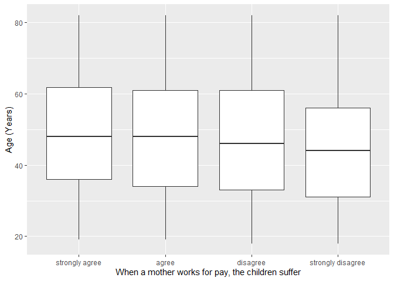
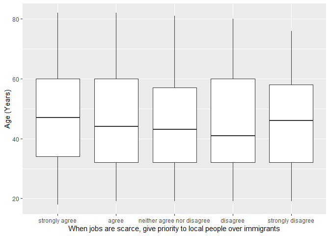

## Introduction

This is the report for the analysis on the [European Value Study (EVS) from 2017](https://search.gesis.org/research_data/ZA7500) which is a survey research program on how Europeans in Belarus think about family, work, religion, politics, and society. We are mainly interested in Europeans thoughts on two questions:

1. When a mother works for pay, do Europeans think the children suffer?
2. When jobs are scarce, do Europeans think employers should give priority to local people over immigrants?

## Descriptives of variables

In the following table, the variables are:

1. `v72` represents the first question of interest (1-strongly agree, 2-agree, 3-disagree, or 4-strongly disagree)
2. `v80` represents the second question of interest (1-strongly agree, 2-agree, 3-neither agree nor disagree, 4-disagree, or 5-strongly disagree)
3. `sex` (1-male or 2-female)
4. `age` (years)
5. `education` (1-lower, 2-medium, or 3-higher)

----------------------------------------------
      v72             v80            age      
--------------- --------------- --------------
 Min.  :1.000    Min.  :1.000    Min.  :18.0  

 1st Qu.:2.000   1st Qu.:1.000   1st Qu.:33.0 

 Median :3.000   Median :1.000   Median :46.0 

  Mean :2.901     Mean :1.742     Mean :46.8  

 3rd Qu.:4.000   3rd Qu.:2.000   3rd Qu.:60.0 

 Max.  :4.000    Max.  :5.000    Max.  :82.0  
----------------------------------------------

Table: Descriptive table for continuous variables

Table: Descriptive table for categorical variables

|Education | Sex|   Freq|
|:---------|---:|------:|
|Lower     |   M|  55.00|
|Medium    |   M| 188.00|
|Higher    |   M| 399.00|
|Lower     |   F|  58.00|
|Medium    |   F| 206.00|
|Higher    |   F| 589.00|

## Graphs

Boxplot for first question of interest (v72)

Boxplot for second question of interest (v80)

## Regression Analysis

### Model: v72 ~ age + $\sqrt{\text{age}}$ + sex + education

---------------------------------------------------------------------
        &nbsp;          Estimate    Std. Error   t value   Pr(>|t|)  
---------------------- ----------- ------------ --------- -----------
   **(Intercept)**        2.937       0.693       4.239    2.388e-05 

       **age**          -0.005879    0.01565     -0.3758    0.7071   

    **sqrt(age)**        0.01856      0.2101     0.08832    0.9296   

    **sex-female**       -0.0196     0.04678     -0.419     0.6753   

 **education-medium**    0.08296     0.09543     0.8693     0.3848   

 **education-higher**    0.1565       0.089       1.759     0.07883  
---------------------------------------------------------------------

---------------------------------------------------------------
 Observations   Residual Std. Error    $R^2$    Adjusted $R^2$ 
-------------- --------------------- --------- ----------------
     1495             0.8905          0.01053      0.00721     
---------------------------------------------------------------

Table: Fitting linear model: v72 ~ age + sqrt(age) + sex + education

The coefficient estimate for `sex` is -0.0196036 which means that the effect of a female respondent compared to a male is negative. The corresponding $p$-value is 0.6752569 which is greater than or equal to 0.05. Thus, `sex` is not significant in the model.

### Model: v80 ~ age + $\sqrt{\text{age}}$ + sex + education

--------------------------------------------------------------------
        &nbsp;          Estimate    Std. Error   t value   Pr(>|t|) 
---------------------- ----------- ------------ --------- ----------
   **(Intercept)**        1.927       0.8347      2.309    0.02109  

       **age**          -0.003166    0.01885     -0.168     0.8666  

    **sqrt(age)**       -0.004959     0.2531     -0.0196    0.9844  

    **sex-female**       0.01593     0.05635     0.2827     0.7775  

 **education-medium**    -0.1001      0.115      -0.8707    0.384   

 **education-higher**    0.02052      0.1072     0.1914     0.8482  
--------------------------------------------------------------------

----------------------------------------------------------------
 Observations   Residual Std. Error    $R^2$     Adjusted $R^2$ 
-------------- --------------------- ---------- ----------------
     1495              1.073          0.005324      0.001984    
----------------------------------------------------------------

Table: Fitting linear model: v80 ~ age + sqrt(age) + sex + education

The coefficient estimate for `sex` is 0.0159295 which means that the effect of a female respondent compared to a male is positive. The corresponding $p$-value is 0.7774632 which is greater than or equal to 0.05. Thus, `sex` is not significant in the model.

