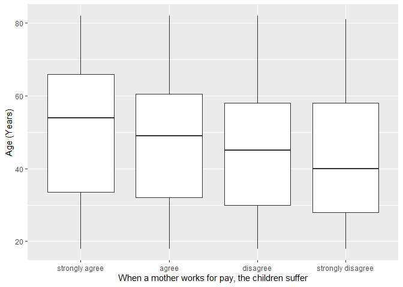
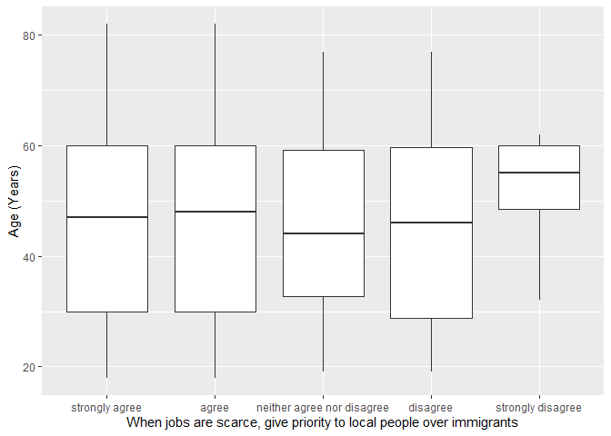

## Introduction

This is the report for the analysis on the [European Value Study (EVS) from 2017](https://search.gesis.org/research_data/ZA7500) which is a survey research program on how Europeans in Bosnia and Herzegovina think about family, work, religion, politics, and society. We are mainly interested in Europeans thoughts on two questions:

1. When a mother works for pay, do Europeans think the children suffer?
2. When jobs are scarce, do Europeans think employers should give priority to local people over immigrants?

## Descriptives of variables

In the following table, the variables are:

1. `v72` represents the first question of interest (1-strongly agree, 2-agree, 3-disagree, or 4-strongly disagree)
2. `v80` represents the second question of interest (1-strongly agree, 2-agree, 3-neither agree nor disagree, 4-disagree, or 5-strongly disagree)
3. `sex` (1-male or 2-female)
4. `age` (years)
5. `education` (1-lower, 2-medium, or 3-higher)

-----------------------------------------------
      v72             v80             age      
--------------- --------------- ---------------
 Min.  :1.000    Min.  :1.000    Min.  :18.00  

 1st Qu.:2.000   1st Qu.:1.000   1st Qu.:30.00 

 Median :3.000   Median :1.000   Median :47.00 

  Mean :2.552     Mean :1.538     Mean :46.29  

 3rd Qu.:3.000   3rd Qu.:2.000   3rd Qu.:60.00 

 Max.  :4.000    Max.  :5.000    Max.  :82.00  
-----------------------------------------------

Table: Descriptive table for continuous variables

Table: Descriptive table for categorical variables

|Education | Sex|  Freq |
|:---------|---:|:------|
|Lower     |   M|110.00 |
|Medium    |   M|491.00 |
|Higher    |   M|117.00 |
|Lower     |   F|250.00 |
|Medium    |   F|518.00 |
|Higher    |   F|164.00 |

## Graphs

Boxplot for first question of interest (v72)

Boxplot for second question of interest (v80)

## Regression Analysis

### Model: v72 ~ age + $\sqrt{\text{age}}$ + sex + education

--------------------------------------------------------------------
        &nbsp;          Estimate   Std. Error   t value   Pr(>|t|)  
---------------------- ---------- ------------ --------- -----------
   **(Intercept)**       1.572       0.5921      2.655    0.008002  

       **age**          -0.02081    0.01457     -1.428     0.1534   

    **sqrt(age)**        0.2354       0.19       1.239     0.2154   

    **sex-female**       0.1169     0.04631      2.525     0.01168  

 **education-medium**    0.3155     0.06259      5.041    5.133e-07 

 **education-higher**    0.6627     0.08064      8.218    4.151e-16 
--------------------------------------------------------------------

---------------------------------------------------------------
 Observations   Residual Std. Error    $R^2$    Adjusted $R^2$ 
-------------- --------------------- --------- ----------------
     1650             0.9178          0.06441      0.06157     
---------------------------------------------------------------

Table: Fitting linear model: v72 ~ age + sqrt(age) + sex + education

The coefficient estimate for `sex` is 0.1169066 which means that the effect of a female respondent compared to a male is positive. The corresponding $p$-value is 0.0116769 which is smaller than 0.05. Thus, `sex` is significant in the model.

### Model: v80 ~ age + $\sqrt{\text{age}}$ + sex + education

-------------------------------------------------------------------
        &nbsp;          Estimate   Std. Error   t value   Pr(>|t|) 
---------------------- ---------- ------------ --------- ----------
   **(Intercept)**       0.8395      0.5552      1.512     0.1307  

       **age**          -0.01268    0.01366     -0.9279    0.3536  

    **sqrt(age)**        0.178       0.1781     0.9994     0.3178  

    **sex-female**       0.0153     0.04342     0.3524     0.7246  

 **education-medium**    0.1157     0.05869      1.971    0.04892  

 **education-higher**    0.1094     0.07561      1.447     0.148   
-------------------------------------------------------------------

----------------------------------------------------------------
 Observations   Residual Std. Error    $R^2$     Adjusted $R^2$ 
-------------- --------------------- ---------- ----------------
     1650             0.8606          0.003736     0.0007055    
----------------------------------------------------------------

Table: Fitting linear model: v80 ~ age + sqrt(age) + sex + education

The coefficient estimate for `sex` is 0.0153015 which means that the effect of a female respondent compared to a male is positive. The corresponding $p$-value is 0.7245833 which is greater than or equal to 0.05. Thus, `sex` is not significant in the model.

