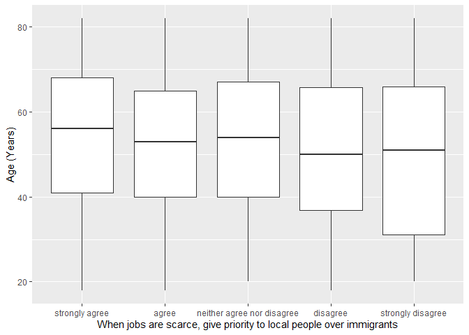

## Introduction

This is the report for the analysis on the [European Value Study (EVS) from 2017](https://search.gesis.org/research_data/ZA7500) which is a survey research program on how Europeans in Bulgaria think about family, work, religion, politics, and society. We are mainly interested in Europeans thoughts on two questions:

1. When a mother works for pay, do Europeans think the children suffer?
2. When jobs are scarce, do Europeans think employers should give priority to local people over immigrants?

## Descriptives of variables

In the following table, the variables are:

1. `v72` represents the first question of interest (1-strongly agree, 2-agree, 3-disagree, or 4-strongly disagree)
2. `v80` represents the second question of interest (1-strongly agree, 2-agree, 3-neither agree nor disagree, 4-disagree, or 5-strongly disagree)
3. `sex` (1-male or 2-female)
4. `age` (years)
5. `education` (1-lower, 2-medium, or 3-higher)

-----------------------------------------------
      v72             v80             age      
--------------- --------------- ---------------
 Min.  :1.000    Min.  :1.000    Min.  :18.00  

 1st Qu.:2.000   1st Qu.:1.000   1st Qu.:40.00 

 Median :3.000   Median :1.000   Median :55.00 

  Mean :2.873     Mean :1.633     Mean :53.21  

 3rd Qu.:3.000   3rd Qu.:2.000   3rd Qu.:67.00 

 Max.  :4.000    Max.  :5.000    Max.  :82.00  
-----------------------------------------------

Table: Descriptive table for continuous variables

Table: Descriptive table for categorical variables

|Education | Sex|  Freq |
|:---------|---:|:------|
|Lower     |   M|119.00 |
|Medium    |   M|342.00 |
|Higher    |   M|125.00 |
|Lower     |   F|164.00 |
|Medium    |   F|478.00 |
|Higher    |   F|242.00 |

## Graphs

Boxplot for first question of interest (v72)

Boxplot for second question of interest (v80)

## Regression Analysis

### Model: v72 ~ age + $\sqrt{\text{age}}$ + sex + education

--------------------------------------------------------------------
        &nbsp;          Estimate   Std. Error   t value   Pr(>|t|)  
---------------------- ---------- ------------ --------- -----------
   **(Intercept)**       4.078       0.6441      6.332    3.216e-10 

       **age**          0.02615     0.01419      1.843     0.06555  

    **sqrt(age)**       -0.3945      0.1947     -2.026     0.04298  

    **sex-female**      0.01957     0.04529     0.4322     0.6657   

 **education-medium**    0.2736      0.0599      4.568    5.348e-06 

 **education-higher**    0.3024     0.07032       4.3     1.822e-05 
--------------------------------------------------------------------

---------------------------------------------------------------
 Observations   Residual Std. Error    $R^2$    Adjusted $R^2$ 
-------------- --------------------- --------- ----------------
     1470             0.8468          0.02115      0.01781     
---------------------------------------------------------------

Table: Fitting linear model: v72 ~ age + sqrt(age) + sex + education

The coefficient estimate for `sex` is 0.0195747 which means that the effect of a female respondent compared to a male is positive. The corresponding $p$-value is 0.6656739 which is greater than or equal to 0.05. Thus, `sex` is not significant in the model.

### Model: v80 ~ age + $\sqrt{\text{age}}$ + sex + education

-------------------------------------------------------------------
        &nbsp;          Estimate   Std. Error   t value   Pr(>|t|) 
---------------------- ---------- ------------ --------- ----------
   **(Intercept)**       1.911       0.689       2.774    0.005604 

       **age**          0.001045    0.01518     0.06888    0.9451  

    **sqrt(age)**       -0.05274     0.2083     -0.2532    0.8002  

    **sex-female**      0.02394     0.04845     0.4941     0.6213  

 **education-medium**   0.01146     0.06407     0.1789     0.8581  

 **education-higher**   0.09645     0.07522      1.282     0.1999  
-------------------------------------------------------------------

----------------------------------------------------------------
 Observations   Residual Std. Error    $R^2$     Adjusted $R^2$ 
-------------- --------------------- ---------- ----------------
     1470             0.9058          0.005343      0.001946    
----------------------------------------------------------------

Table: Fitting linear model: v80 ~ age + sqrt(age) + sex + education

The coefficient estimate for `sex` is 0.0239388 which means that the effect of a female respondent compared to a male is positive. The corresponding $p$-value is 0.6213077 which is greater than or equal to 0.05. Thus, `sex` is not significant in the model.

