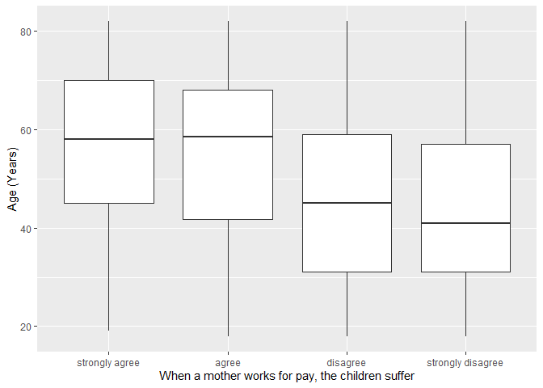
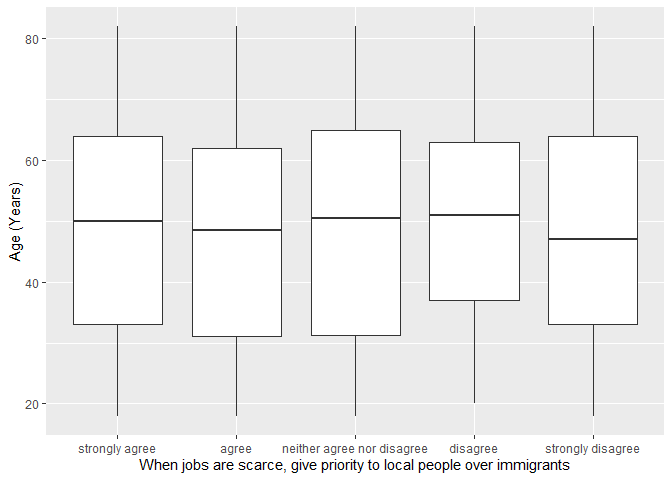

## Introduction

This is the report for the analysis on the [European Value Study (EVS) from 2017](https://search.gesis.org/research_data/ZA7500) which is a survey research program on how Europeans in Croatia think about family, work, religion, politics, and society. We are mainly interested in Europeans thoughts on two questions:

1. When a mother works for pay, do Europeans think the children suffer?
2. When jobs are scarce, do Europeans think employers should give priority to local people over immigrants?

## Descriptives of variables

In the following table, the variables are:

1. `v72` represents the first question of interest (1-strongly agree, 2-agree, 3-disagree, or 4-strongly disagree)
2. `v80` represents the second question of interest (1-strongly agree, 2-agree, 3-neither agree nor disagree, 4-disagree, or 5-strongly disagree)
3. `sex` (1-male or 2-female)
4. `age` (years)
5. `education` (1-lower, 2-medium, or 3-higher)

----------------------------------------------
      v72            v80             age      
--------------- -------------- ---------------
 Min.  :1.000    Min.  :1.00    Min.  :18.00  

 1st Qu.:2.000   1st Qu.:1.00   1st Qu.:33.00 

 Median :3.000   Median :2.00   Median :50.00 

  Mean :2.651     Mean :2.26     Mean :48.87  

 3rd Qu.:3.000   3rd Qu.:3.00   3rd Qu.:64.00 

 Max.  :4.000    Max.  :5.00    Max.  :82.00  
----------------------------------------------

Table: Descriptive table for continuous variables

Table: Descriptive table for categorical variables

|Education | Sex|   Freq|
|:---------|---:|------:|
|Lower     |   M|  47.00|
|Medium    |   M| 348.00|
|Higher    |   M| 206.00|
|Lower     |   F| 147.00|
|Medium    |   F| 452.00|
|Higher    |   F| 236.00|

## Graphs

Boxplot for first question of interest (v72)

Boxplot for second question of interest (v80)

## Regression Analysis

### Model: v72 ~ age + $\sqrt{\text{age}}$ + sex + education

--------------------------------------------------------------------
        &nbsp;          Estimate   Std. Error   t value   Pr(>|t|)  
---------------------- ---------- ------------ --------- -----------
   **(Intercept)**       1.858       0.5542      3.352    0.0008223 

       **age**          -0.03494    0.01269     -2.753    0.005982  

    **sqrt(age)**        0.3335      0.1703      1.958     0.05037  

    **sex-female**      0.004011    0.04136     0.09698    0.9228   

 **education-medium**     0.17      0.06476      2.625    0.008755  

 **education-higher**    0.3693     0.06915      5.341    1.072e-07 
--------------------------------------------------------------------

---------------------------------------------------------------
 Observations   Residual Std. Error    $R^2$    Adjusted $R^2$ 
-------------- --------------------- --------- ----------------
     1436             0.7624          0.09092      0.08774     
---------------------------------------------------------------

Table: Fitting linear model: v72 ~ age + sqrt(age) + sex + education

The coefficient estimate for `sex` is 0.0040113 which means that the effect of a female respondent compared to a male is positive. The corresponding $p$-value is 0.9227555 which is greater than or equal to 0.05. Thus, `sex` is not significant in the model.

### Model: v80 ~ age + $\sqrt{\text{age}}$ + sex + education

--------------------------------------------------------------------
        &nbsp;          Estimate   Std. Error   t value   Pr(>|t|)  
---------------------- ---------- ------------ --------- -----------
   **(Intercept)**       0.4923      0.8941     0.5506      0.582   

       **age**          -0.02993    0.02048     -1.461     0.1441   

    **sqrt(age)**        0.4366      0.2747      1.589     0.1122   

    **sex-female**      -0.09419    0.06673     -1.412     0.1583   

 **education-medium**    0.2357      0.1045      2.256     0.02421  

 **education-higher**    0.5057      0.1116      4.533    6.296e-06 
--------------------------------------------------------------------

---------------------------------------------------------------
 Observations   Residual Std. Error    $R^2$    Adjusted $R^2$ 
-------------- --------------------- --------- ----------------
     1436              1.23           0.02234      0.01892     
---------------------------------------------------------------

Table: Fitting linear model: v80 ~ age + sqrt(age) + sex + education

The coefficient estimate for `sex` is -0.0941929 which means that the effect of a female respondent compared to a male is negative. The corresponding $p$-value is 0.1583018 which is greater than or equal to 0.05. Thus, `sex` is not significant in the model.

