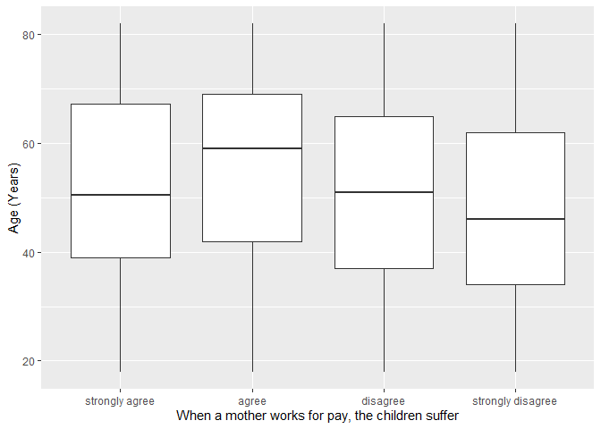
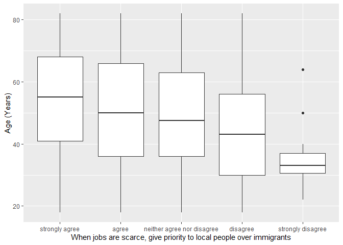

## Introduction

This is the report for the analysis on the [European Value Study (EVS) from 2017](https://search.gesis.org/research_data/ZA7500) which is a survey research program on how Europeans in Czechia think about family, work, religion, politics, and society. We are mainly interested in Europeans thoughts on two questions:

1. When a mother works for pay, do Europeans think the children suffer?
2. When jobs are scarce, do Europeans think employers should give priority to local people over immigrants?

## Descriptives of variables

In the following table, the variables are:

1. `v72` represents the first question of interest (1-strongly agree, 2-agree, 3-disagree, or 4-strongly disagree)
2. `v80` represents the second question of interest (1-strongly agree, 2-agree, 3-neither agree nor disagree, 4-disagree, or 5-strongly disagree)
3. `sex` (1-male or 2-female)
4. `age` (years)
5. `education` (1-lower, 2-medium, or 3-higher)

-----------------------------------------------
      v72             v80             age      
--------------- --------------- ---------------
 Min.  :1.000    Min.  :1.000    Min.  :18.00  

 1st Qu.:2.000   1st Qu.:1.000   1st Qu.:38.00 

 Median :3.000   Median :1.000   Median :52.00 

  Mean :2.736     Mean :1.736     Mean :51.59  

 3rd Qu.:3.000   3rd Qu.:2.000   3rd Qu.:66.00 

 Max.  :4.000    Max.  :5.000    Max.  :82.00  
-----------------------------------------------

Table: Descriptive table for continuous variables

Table: Descriptive table for categorical variables

|Education | Sex|   Freq|
|:---------|---:|------:|
|Lower     |   M|  43.00|
|Medium    |   M| 481.00|
|Higher    |   M| 132.00|
|Lower     |   F| 111.00|
|Medium    |   F| 696.00|
|Higher    |   F| 187.00|

## Graphs

Boxplot for first question of interest (v72)

Boxplot for second question of interest (v80)

## Regression Analysis

### Model: v72 ~ age + $\sqrt{\text{age}}$ + sex + education

---------------------------------------------------------------------
        &nbsp;          Estimate    Std. Error   t value   Pr(>|t|)  
---------------------- ----------- ------------ --------- -----------
   **(Intercept)**        2.754       0.548       5.026    5.554e-07 

       **age**          -0.002696    0.01218     -0.2214    0.8248   

    **sqrt(age)**       -0.02139      0.1675     -0.1277    0.8984   

    **sex-female**      0.0008621    0.03794     0.02273    0.9819   

 **education-medium**    0.2579      0.06717      3.839    0.0001281 

 **education-higher**    0.4526      0.07627      5.935    3.584e-09 
---------------------------------------------------------------------

--------------------------------------------------------------
 Observations   Residual Std. Error   $R^2$    Adjusted $R^2$ 
-------------- --------------------- -------- ----------------
     1650             0.7502          0.0349      0.03197     
--------------------------------------------------------------

Table: Fitting linear model: v72 ~ age + sqrt(age) + sex + education

The coefficient estimate for `sex` is 8.6214046\times 10^{-4} which means that the effect of a female respondent compared to a male is positive. The corresponding $p$-value is 0.9818723 which is greater than or equal to 0.05. Thus, `sex` is not significant in the model.

### Model: v80 ~ age + $\sqrt{\text{age}}$ + sex + education

--------------------------------------------------------------------
        &nbsp;          Estimate   Std. Error   t value   Pr(>|t|)  
---------------------- ---------- ------------ --------- -----------
   **(Intercept)**       2.608       0.6566      3.972    7.448e-05 

       **age**          0.002491    0.01459     0.1708     0.8644   

    **sqrt(age)**        -0.146      0.2007     -0.7274    0.4671   

    **sex-female**      -0.1251     0.04546     -2.752    0.005996  

 **education-medium**   0.03952     0.08048      0.491     0.6235   

 **education-higher**    0.4137     0.09138      4.527    6.406e-06 
--------------------------------------------------------------------

---------------------------------------------------------------
 Observations   Residual Std. Error    $R^2$    Adjusted $R^2$ 
-------------- --------------------- --------- ----------------
     1650             0.8989          0.06209      0.05923     
---------------------------------------------------------------

Table: Fitting linear model: v80 ~ age + sqrt(age) + sex + education

The coefficient estimate for `sex` is -0.1250748 which means that the effect of a female respondent compared to a male is negative. The corresponding $p$-value is 0.005996 which is smaller than 0.05. Thus, `sex` is significant in the model.

