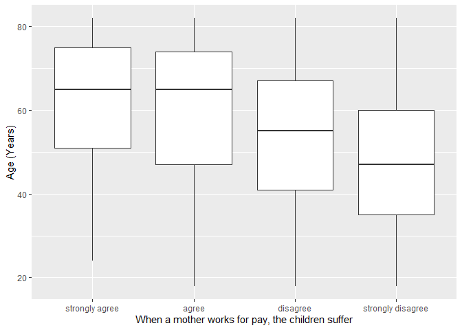
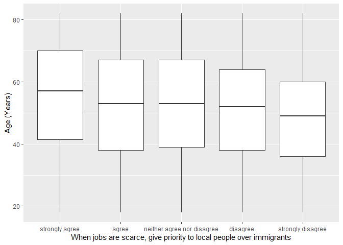

## Introduction

This is the report for the analysis on the [European Value Study (EVS) from 2017](https://search.gesis.org/research_data/ZA7500) which is a survey research program on how Europeans in Denmark think about family, work, religion, politics, and society. We are mainly interested in Europeans thoughts on two questions:

1. When a mother works for pay, do Europeans think the children suffer?
2. When jobs are scarce, do Europeans think employers should give priority to local people over immigrants?

## Descriptives of variables

In the following table, the variables are:

1. `v72` represents the first question of interest (1-strongly agree, 2-agree, 3-disagree, or 4-strongly disagree)
2. `v80` represents the second question of interest (1-strongly agree, 2-agree, 3-neither agree nor disagree, 4-disagree, or 5-strongly disagree)
3. `sex` (1-male or 2-female)
4. `age` (years)
5. `education` (1-lower, 2-medium, or 3-higher)

-----------------------------------------------
      v72             v80             age      
--------------- --------------- ---------------
 Min.  :1.000    Min.  :1.000    Min.  :18.00  

 1st Qu.:3.000   1st Qu.:2.000   1st Qu.:38.00 

 Median :3.000   Median :3.000   Median :52.00 

  Mean :3.302     Mean :3.112     Mean :51.48  

 3rd Qu.:4.000   3rd Qu.:4.000   3rd Qu.:66.00 

 Max.  :4.000    Max.  :5.000    Max.  :82.00  
-----------------------------------------------

Table: Descriptive table for continuous variables

Table: Descriptive table for categorical variables

|Education | Sex|  Freq |
|:---------|---:|:------|
|Lower     |   M|249.00 |
|Medium    |   M|600.00 |
|Higher    |   M|712.00 |
|Lower     |   F|322.00 |
|Medium    |   F|415.00 |
|Higher    |   F|924.00 |

## Graphs

Boxplot for first question of interest (v72)

Boxplot for second question of interest (v80)

## Regression Analysis

### Model: v72 ~ age + $\sqrt{\text{age}}$ + sex + education

--------------------------------------------------------------------
        &nbsp;          Estimate   Std. Error   t value   Pr(>|t|)  
---------------------- ---------- ------------ --------- -----------
   **(Intercept)**       1.499       0.318       4.714    2.529e-06 

       **age**          -0.05412    0.007143    -7.577    4.591e-14 

    **sqrt(age)**        0.6222     0.09696      6.417    1.596e-10 

    **sex-female**       0.0698     0.02377      2.937    0.003337  

 **education-medium**   0.07453     0.03543      2.104     0.0355   

 **education-higher**    0.2727     0.03335      8.176    4.173e-16 
--------------------------------------------------------------------

--------------------------------------------------------------
 Observations   Residual Std. Error   $R^2$    Adjusted $R^2$ 
-------------- --------------------- -------- ----------------
     3222              0.667          0.1011      0.09969     
--------------------------------------------------------------

Table: Fitting linear model: v72 ~ age + sqrt(age) + sex + education

The coefficient estimate for `sex` is 0.069801 which means that the effect of a female respondent compared to a male is positive. The corresponding $p$-value is 0.0033374 which is smaller than 0.05. Thus, `sex` is significant in the model.

### Model: v80 ~ age + $\sqrt{\text{age}}$ + sex + education

--------------------------------------------------------------------
        &nbsp;          Estimate   Std. Error   t value   Pr(>|t|)  
---------------------- ---------- ------------ --------- -----------
   **(Intercept)**       0.9752      0.587       1.661     0.09678  

       **age**          -0.05332    0.01319     -4.044    5.389e-05 

    **sqrt(age)**        0.6298      0.179       3.519    0.0004397 

    **sex-female**      0.03293     0.04388     0.7504     0.4531   

 **education-medium**    0.1259     0.06541      1.924     0.05444  

 **education-higher**    0.7479     0.06157      12.15    3.096e-33 
--------------------------------------------------------------------

---------------------------------------------------------------
 Observations   Residual Std. Error    $R^2$    Adjusted $R^2$ 
-------------- --------------------- --------- ----------------
     3222              1.231          0.09186      0.09045     
---------------------------------------------------------------

Table: Fitting linear model: v80 ~ age + sqrt(age) + sex + education

The coefficient estimate for `sex` is 0.0329251 which means that the effect of a female respondent compared to a male is positive. The corresponding $p$-value is 0.4530544 which is greater than or equal to 0.05. Thus, `sex` is not significant in the model.

