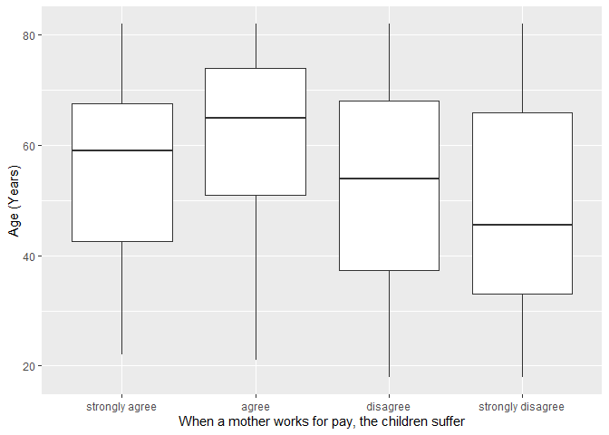
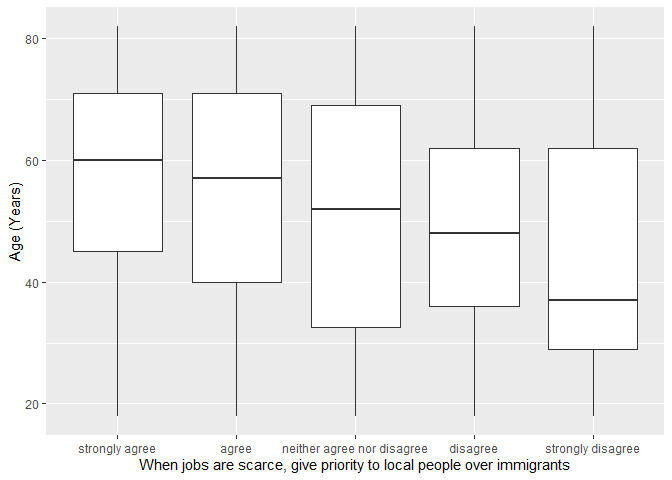

## Introduction

This is the report for the analysis on the [European Value Study (EVS) from 2017](https://search.gesis.org/research_data/ZA7500) which is a survey research program on how Europeans in Estonia think about family, work, religion, politics, and society. We are mainly interested in Europeans thoughts on two questions:

1. When a mother works for pay, do Europeans think the children suffer?
2. When jobs are scarce, do Europeans think employers should give priority to local people over immigrants?

## Descriptives of variables

In the following table, the variables are:

1. `v72` represents the first question of interest (1-strongly agree, 2-agree, 3-disagree, or 4-strongly disagree)
2. `v80` represents the second question of interest (1-strongly agree, 2-agree, 3-neither agree nor disagree, 4-disagree, or 5-strongly disagree)
3. `sex` (1-male or 2-female)
4. `age` (years)
5. `education` (1-lower, 2-medium, or 3-higher)

-----------------------------------------------
      v72             v80             age      
--------------- --------------- ---------------
 Min.  :1.000    Min.  :1.000    Min.  :18.00  

 1st Qu.:3.000   1st Qu.:1.000   1st Qu.:38.00 

 Median :3.000   Median :2.000   Median :56.00 

  Mean :2.879     Mean :2.067     Mean :54.39  

 3rd Qu.:3.000   3rd Qu.:3.000   3rd Qu.:70.00 

 Max.  :4.000    Max.  :5.000    Max.  :82.00  
-----------------------------------------------

Table: Descriptive table for continuous variables

Table: Descriptive table for categorical variables

|Education | Sex|   Freq|
|:---------|---:|------:|
|Lower     |   M|  70.00|
|Medium    |   M| 250.00|
|Higher    |   M| 133.00|
|Lower     |   F| 110.00|
|Medium    |   F| 416.00|
|Higher    |   F| 258.00|

## Graphs

Boxplot for first question of interest (v72)

Boxplot for second question of interest (v80)

## Regression Analysis

### Model: v72 ~ age + $\sqrt{\text{age}}$ + sex + education

---------------------------------------------------------------------
        &nbsp;          Estimate    Std. Error   t value   Pr(>|t|)  
---------------------- ----------- ------------ --------- -----------
   **(Intercept)**        4.487       0.5607      8.003    2.787e-15 

       **age**           0.02213     0.01194      1.853     0.06412  

    **sqrt(age)**        -0.4036      0.1666     -2.422     0.01559  

    **sex-female**      -0.006666    0.04236     -0.1574     0.875   

 **education-medium**    0.07194      0.0587      1.226     0.2206   

 **education-higher**    0.2593       0.0637      4.071    4.988e-05 
---------------------------------------------------------------------

---------------------------------------------------------------
 Observations   Residual Std. Error    $R^2$    Adjusted $R^2$ 
-------------- --------------------- --------- ----------------
     1237             0.6914          0.05373      0.04989     
---------------------------------------------------------------

Table: Fitting linear model: v72 ~ age + sqrt(age) + sex + education

The coefficient estimate for `sex` is -0.0066662 which means that the effect of a female respondent compared to a male is negative. The corresponding $p$-value is 0.8749822 which is greater than or equal to 0.05. Thus, `sex` is not significant in the model.

### Model: v80 ~ age + $\sqrt{\text{age}}$ + sex + education

----------------------------------------------------------------------
        &nbsp;          Estimate    Std. Error   t value    Pr(>|t|)  
---------------------- ----------- ------------ ---------- -----------
   **(Intercept)**        5.964       0.8924      6.683     3.531e-11 

       **age**           0.06117     0.01901      3.218     0.001323  

    **sqrt(age)**        -1.026       0.2652      -3.869    0.0001152 

    **sex-female**       0.1666      0.06742      2.472      0.01358  

 **education-medium**   -0.005286    0.09343     -0.05658    0.9549   

 **education-higher**    0.3754       0.1014      3.703     0.0002227 
----------------------------------------------------------------------

---------------------------------------------------------------
 Observations   Residual Std. Error    $R^2$    Adjusted $R^2$ 
-------------- --------------------- --------- ----------------
     1237               1.1           0.07154      0.06776     
---------------------------------------------------------------

Table: Fitting linear model: v80 ~ age + sqrt(age) + sex + education

The coefficient estimate for `sex` is 0.1666482 which means that the effect of a female respondent compared to a male is positive. The corresponding $p$-value is 0.0135821 which is smaller than 0.05. Thus, `sex` is significant in the model.

