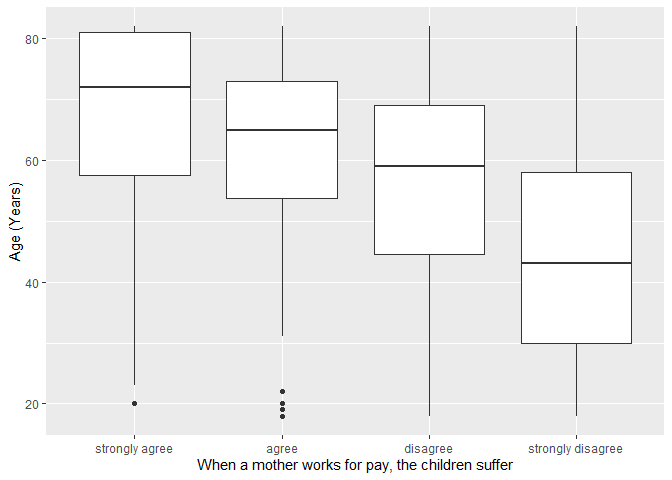
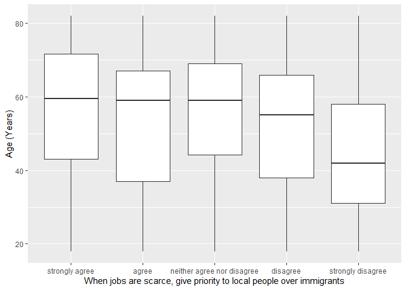

## Introduction

This is the report for the analysis on the [European Value Study (EVS) from 2017](https://search.gesis.org/research_data/ZA7500) which is a survey research program on how Europeans in Finland think about family, work, religion, politics, and society. We are mainly interested in Europeans thoughts on two questions:

1. When a mother works for pay, do Europeans think the children suffer?
2. When jobs are scarce, do Europeans think employers should give priority to local people over immigrants?

## Descriptives of variables

In the following table, the variables are:

1. `v72` represents the first question of interest (1-strongly agree, 2-agree, 3-disagree, or 4-strongly disagree)
2. `v80` represents the second question of interest (1-strongly agree, 2-agree, 3-neither agree nor disagree, 4-disagree, or 5-strongly disagree)
3. `sex` (1-male or 2-female)
4. `age` (years)
5. `education` (1-lower, 2-medium, or 3-higher)

-----------------------------------------------
      v72             v80             age      
--------------- --------------- ---------------
 Min.  :1.000    Min.  :1.000    Min.  :18.00  

 1st Qu.:3.000   1st Qu.:2.000   1st Qu.:38.00 

 Median :3.000   Median :3.000   Median :57.00 

  Mean :3.113     Mean :2.782     Mean :53.35  

 3rd Qu.:4.000   3rd Qu.:4.000   3rd Qu.:68.00 

 Max.  :4.000    Max.  :5.000    Max.  :82.00  
-----------------------------------------------

Table: Descriptive table for continuous variables

Table: Descriptive table for categorical variables

|Education | Sex|   Freq|
|:---------|---:|------:|
|Lower     |   M|  87.00|
|Medium    |   M| 234.00|
|Higher    |   M| 220.00|
|Lower     |   F|  83.00|
|Medium    |   F| 212.00|
|Higher    |   F| 291.00|

## Graphs

Boxplot for first question of interest (v72)

Boxplot for second question of interest (v80)

## Regression Analysis

### Model: v72 ~ age + $\sqrt{\text{age}}$ + sex + education

--------------------------------------------------------------------
        &nbsp;          Estimate   Std. Error   t value   Pr(>|t|)  
---------------------- ---------- ------------ --------- -----------
   **(Intercept)**        2.06       0.5213      3.951    8.264e-05 

       **age**          -0.04221    0.01201     -3.513    0.0004604 

    **sqrt(age)**        0.4261      0.1621      2.628    0.008696  

    **sex-female**       0.1304      0.0381      3.421    0.0006454 

 **education-medium**    0.1277     0.06095      2.095     0.03641  

 **education-higher**    0.2791     0.06112      4.566    5.51e-06  
--------------------------------------------------------------------

--------------------------------------------------------------
 Observations   Residual Std. Error   $R^2$    Adjusted $R^2$ 
-------------- --------------------- -------- ----------------
     1127              0.636          0.1456       0.1418     
--------------------------------------------------------------

Table: Fitting linear model: v72 ~ age + sqrt(age) + sex + education

The coefficient estimate for `sex` is 0.1303663 which means that the effect of a female respondent compared to a male is positive. The corresponding $p$-value is 6.4543354\times 10^{-4} which is smaller than 0.05. Thus, `sex` is significant in the model.

### Model: v80 ~ age + $\sqrt{\text{age}}$ + sex + education

-------------------------------------------------------------------
        &nbsp;          Estimate   Std. Error   t value   Pr(>|t|) 
---------------------- ---------- ------------ --------- ----------
   **(Intercept)**       2.245       0.9662      2.324     0.0203  

       **age**          -0.01152    0.02227     -0.5173    0.6051  

    **sqrt(age)**       0.08069      0.3004     0.2686     0.7883  

    **sex-female**       0.1326     0.07062      1.877    0.06071  

 **education-medium**    0.2938      0.113       2.601    0.009413 

 **education-higher**    0.8514      0.1133      7.515    1.16e-13 
-------------------------------------------------------------------

---------------------------------------------------------------
 Observations   Residual Std. Error    $R^2$    Adjusted $R^2$ 
-------------- --------------------- --------- ----------------
     1127              1.179          0.09243      0.08838     
---------------------------------------------------------------

Table: Fitting linear model: v80 ~ age + sqrt(age) + sex + education

The coefficient estimate for `sex` is 0.1325935 which means that the effect of a female respondent compared to a male is positive. The corresponding $p$-value is 0.0607121 which is greater than or equal to 0.05. Thus, `sex` is not significant in the model.

