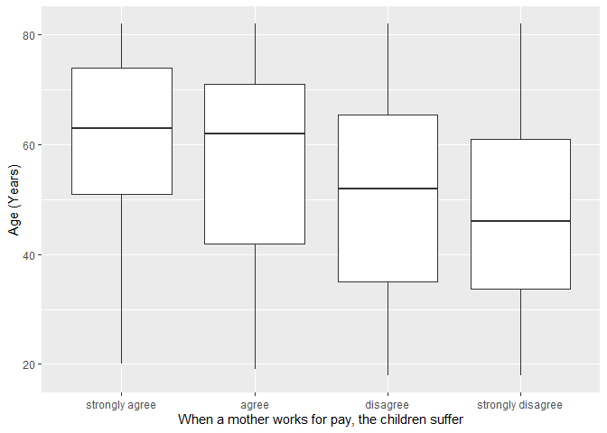
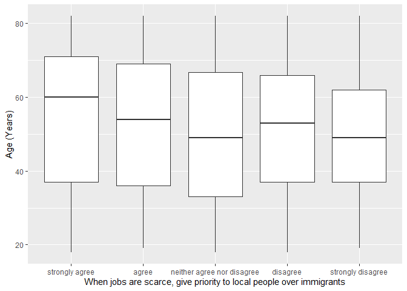

## Introduction

This is the report for the analysis on the [European Value Study (EVS) from 2017](https://search.gesis.org/research_data/ZA7500) which is a survey research program on how Europeans in France think about family, work, religion, politics, and society. We are mainly interested in Europeans thoughts on two questions:

1. When a mother works for pay, do Europeans think the children suffer?
2. When jobs are scarce, do Europeans think employers should give priority to local people over immigrants?

## Descriptives of variables

In the following table, the variables are:

1. `v72` represents the first question of interest (1-strongly agree, 2-agree, 3-disagree, or 4-strongly disagree)
2. `v80` represents the second question of interest (1-strongly agree, 2-agree, 3-neither agree nor disagree, 4-disagree, or 5-strongly disagree)
3. `sex` (1-male or 2-female)
4. `age` (years)
5. `education` (1-lower, 2-medium, or 3-higher)

-----------------------------------------------
      v72             v80             age      
--------------- --------------- ---------------
 Min.  :1.000    Min.  :1.000    Min.  :18.00  

 1st Qu.:2.000   1st Qu.:2.000   1st Qu.:36.00 

 Median :3.000   Median :3.000   Median :53.00 

  Mean :2.992     Mean :2.994     Mean :51.86  

 3rd Qu.:4.000   3rd Qu.:4.000   3rd Qu.:67.00 

 Max.  :4.000    Max.  :5.000    Max.  :82.00  
-----------------------------------------------

Table: Descriptive table for continuous variables

Table: Descriptive table for categorical variables

|Education | Sex|  Freq |
|:---------|---:|:------|
|Lower     |   M|174.00 |
|Medium    |   M|381.00 |
|Higher    |   M|270.00 |
|Lower     |   F|273.00 |
|Medium    |   F|426.00 |
|Higher    |   F|291.00 |

## Graphs

Boxplot for first question of interest (v72)

Boxplot for second question of interest (v80)

## Regression Analysis

### Model: v72 ~ age + $\sqrt{\text{age}}$ + sex + education

--------------------------------------------------------------------
        &nbsp;          Estimate   Std. Error   t value   Pr(>|t|)  
---------------------- ---------- ------------ --------- -----------
   **(Intercept)**       2.406       0.5712      4.213    2.642e-05 

       **age**          -0.02553    0.01265     -2.019     0.04367  

    **sqrt(age)**        0.2306      0.1731      1.332      0.183   

    **sex-female**      0.01886     0.04183     0.4508     0.6522   

 **education-medium**    0.2037     0.05562      3.662    0.0002576 

 **education-higher**    0.5729     0.06069      9.44     1.105e-20 
--------------------------------------------------------------------

--------------------------------------------------------------
 Observations   Residual Std. Error   $R^2$    Adjusted $R^2$ 
-------------- --------------------- -------- ----------------
     1815             0.8848          0.1115       0.109      
--------------------------------------------------------------

Table: Fitting linear model: v72 ~ age + sqrt(age) + sex + education

The coefficient estimate for `sex` is 0.0188567 which means that the effect of a female respondent compared to a male is positive. The corresponding $p$-value is 0.6521896 which is greater than or equal to 0.05. Thus, `sex` is not significant in the model.

### Model: v80 ~ age + $\sqrt{\text{age}}$ + sex + education

----------------------------------------------------------------------
        &nbsp;          Estimate    Std. Error   t value    Pr(>|t|)  
---------------------- ----------- ------------ ---------- -----------
   **(Intercept)**       -2.392       0.9167      -2.61     0.009134  

       **age**           -0.1209      0.0203      -5.957    3.072e-09 

    **sqrt(age)**         1.613       0.2778      5.806     7.545e-09 

    **sex-female**      -0.001026    0.06713     -0.01529    0.9878   

 **education-medium**    0.08454     0.08927      0.947      0.3437   

 **education-higher**    0.6608      0.09741      6.784     1.579e-11 
----------------------------------------------------------------------

---------------------------------------------------------------
 Observations   Residual Std. Error    $R^2$    Adjusted $R^2$ 
-------------- --------------------- --------- ----------------
     1815              1.42           0.06876      0.06618     
---------------------------------------------------------------

Table: Fitting linear model: v80 ~ age + sqrt(age) + sex + education

The coefficient estimate for `sex` is -0.0010264 which means that the effect of a female respondent compared to a male is negative. The corresponding $p$-value is 0.9878034 which is greater than or equal to 0.05. Thus, `sex` is not significant in the model.

