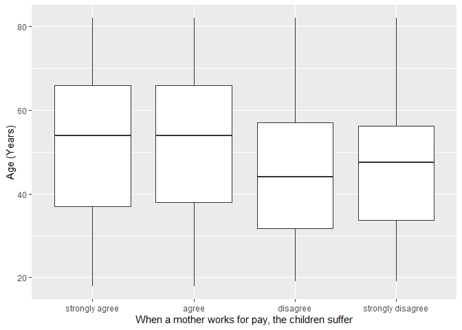
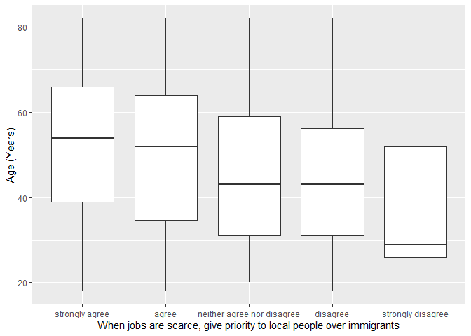

## Introduction

This is the report for the analysis on the [European Value Study (EVS) from 2017](https://search.gesis.org/research_data/ZA7500) which is a survey research program on how Europeans in Georgia think about family, work, religion, politics, and society. We are mainly interested in Europeans thoughts on two questions:

1. When a mother works for pay, do Europeans think the children suffer?
2. When jobs are scarce, do Europeans think employers should give priority to local people over immigrants?

## Descriptives of variables

In the following table, the variables are:

1. `v72` represents the first question of interest (1-strongly agree, 2-agree, 3-disagree, or 4-strongly disagree)
2. `v80` represents the second question of interest (1-strongly agree, 2-agree, 3-neither agree nor disagree, 4-disagree, or 5-strongly disagree)
3. `sex` (1-male or 2-female)
4. `age` (years)
5. `education` (1-lower, 2-medium, or 3-higher)

-----------------------------------------------
      v72             v80             age      
--------------- --------------- ---------------
 Min.  :1.000    Min.  :1.000    Min.  :18.00  

 1st Qu.:1.000   1st Qu.:1.000   1st Qu.:36.00 

 Median :2.000   Median :1.000   Median :52.00 

  Mean :1.972     Mean :1.654     Mean :50.93  

 3rd Qu.:2.000   3rd Qu.:2.000   3rd Qu.:65.00 

 Max.  :4.000    Max.  :5.000    Max.  :82.00  
-----------------------------------------------

Table: Descriptive table for continuous variables

Table: Descriptive table for categorical variables

|Education | Sex|  Freq |
|:---------|---:|:------|
|Lower     |   M|113.00 |
|Medium    |   M|444.00 |
|Higher    |   M|220.00 |
|Lower     |   F|194.00 |
|Medium    |   F|712.00 |
|Higher    |   F|447.00 |

## Graphs

Boxplot for first question of interest (v72)

Boxplot for second question of interest (v80)

## Regression Analysis

### Model: v72 ~ age + $\sqrt{\text{age}}$ + sex + education

---------------------------------------------------------------------
        &nbsp;          Estimate    Std. Error   t value   Pr(>|t|)  
---------------------- ----------- ------------ --------- -----------
   **(Intercept)**        1.96        0.4327      4.529    6.245e-06 

       **age**          -0.008615    0.009511    -0.9059    0.3651   

    **sqrt(age)**        0.05421      0.1304     0.4159     0.6775   

    **sex-female**      -0.03469     0.03212      -1.08     0.2802   

 **education-medium**    0.03511     0.04601     0.7631     0.4455   

 **education-higher**    0.2353      0.04955      4.749    2.181e-06 
---------------------------------------------------------------------

---------------------------------------------------------------
 Observations   Residual Std. Error    $R^2$    Adjusted $R^2$ 
-------------- --------------------- --------- ----------------
     2130             0.7124          0.03171      0.02943     
---------------------------------------------------------------

Table: Fitting linear model: v72 ~ age + sqrt(age) + sex + education

The coefficient estimate for `sex` is -0.0346946 which means that the effect of a female respondent compared to a male is negative. The corresponding $p$-value is 0.2802338 which is greater than or equal to 0.05. Thus, `sex` is not significant in the model.

### Model: v80 ~ age + $\sqrt{\text{age}}$ + sex + education

--------------------------------------------------------------------
        &nbsp;          Estimate   Std. Error   t value   Pr(>|t|)  
---------------------- ---------- ------------ --------- -----------
   **(Intercept)**       3.723       0.5497      6.773    1.624e-11 

       **age**          0.02755     0.01208      2.28      0.02272  

    **sqrt(age)**       -0.4921      0.1656     -2.971    0.002998  

    **sex-female**      0.08922     0.04081      2.186     0.0289   

 **education-medium**   -0.1385     0.05845     -2.369     0.01793  

 **education-higher**   0.003574    0.06295     0.05677    0.9547   
--------------------------------------------------------------------

---------------------------------------------------------------
 Observations   Residual Std. Error    $R^2$    Adjusted $R^2$ 
-------------- --------------------- --------- ----------------
     2130             0.9051          0.03746      0.03519     
---------------------------------------------------------------

Table: Fitting linear model: v80 ~ age + sqrt(age) + sex + education

The coefficient estimate for `sex` is 0.0892221 which means that the effect of a female respondent compared to a male is positive. The corresponding $p$-value is 0.0289015 which is smaller than 0.05. Thus, `sex` is significant in the model.

