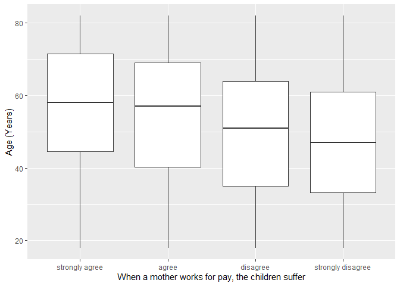
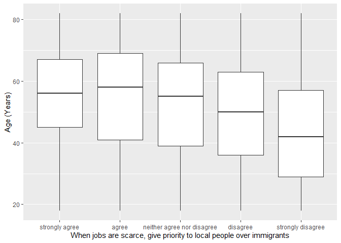

## Introduction

This is the report for the analysis on the [European Value Study (EVS) from 2017](https://search.gesis.org/research_data/ZA7500) which is a survey research program on how Europeans in Germany think about family, work, religion, politics, and society. We are mainly interested in Europeans thoughts on two questions:

1. When a mother works for pay, do Europeans think the children suffer?
2. When jobs are scarce, do Europeans think employers should give priority to local people over immigrants?

## Descriptives of variables

In the following table, the variables are:

1. `v72` represents the first question of interest (1-strongly agree, 2-agree, 3-disagree, or 4-strongly disagree)
2. `v80` represents the second question of interest (1-strongly agree, 2-agree, 3-neither agree nor disagree, 4-disagree, or 5-strongly disagree)
3. `sex` (1-male or 2-female)
4. `age` (years)
5. `education` (1-lower, 2-medium, or 3-higher)

----------------------------------------------
      v72             v80            age      
--------------- --------------- --------------
 Min.  :1.000    Min.  :1.000    Min.  :18.0  

 1st Qu.:2.000   1st Qu.:2.000   1st Qu.:36.0 

 Median :3.000   Median :3.000   Median :52.0 

  Mean :2.817     Mean :3.268     Mean :50.8  

 3rd Qu.:3.000   3rd Qu.:4.000   3rd Qu.:65.0 

 Max.  :4.000    Max.  :5.000    Max.  :82.0  
----------------------------------------------

Table: Descriptive table for continuous variables

Table: Descriptive table for categorical variables

|Education | Sex|   Freq|
|:---------|---:|------:|
|Lower     |   M|  99.00|
|Medium    |   M| 494.00|
|Higher    |   M| 444.00|
|Lower     |   F| 146.00|
|Medium    |   F| 578.00|
|Higher    |   F| 306.00|

## Graphs

Boxplot for first question of interest (v72)

Boxplot for second question of interest (v80)

## Regression Analysis

### Model: v72 ~ age + $\sqrt{\text{age}}$ + sex + education

--------------------------------------------------------------------
        &nbsp;          Estimate   Std. Error   t value   Pr(>|t|)  
---------------------- ---------- ------------ --------- -----------
   **(Intercept)**       1.713       0.4641      3.692    0.0002282 

       **age**          -0.03122    0.01031     -3.027    0.002501  

    **sqrt(age)**        0.3225      0.1403      2.299     0.02162  

    **sex-female**       0.3269     0.03486      9.377    1.722e-20 

 **education-medium**    0.1777     0.05559      3.196    0.001414  

 **education-higher**    0.4804     0.05839      8.227    3.353e-16 
--------------------------------------------------------------------

--------------------------------------------------------------
 Observations   Residual Std. Error   $R^2$    Adjusted $R^2$ 
-------------- --------------------- -------- ----------------
     2067             0.7837          0.1054       0.1032     
--------------------------------------------------------------

Table: Fitting linear model: v72 ~ age + sqrt(age) + sex + education

The coefficient estimate for `sex` is 0.3268875 which means that the effect of a female respondent compared to a male is positive. The corresponding $p$-value is 1.7216909\times 10^{-20} which is smaller than 0.05. Thus, `sex` is significant in the model.

### Model: v80 ~ age + $\sqrt{\text{age}}$ + sex + education

--------------------------------------------------------------------
        &nbsp;          Estimate   Std. Error   t value   Pr(>|t|)  
---------------------- ---------- ------------ --------- -----------
   **(Intercept)**       3.661       0.705       5.192    2.28e-07  

       **age**          -0.01616    0.01567     -1.031     0.3026   

    **sqrt(age)**       0.02909      0.2131     0.1365     0.8914   

    **sex-female**       0.143      0.05295      2.701     0.00698  

 **education-medium**    -0.02      0.08445     -0.2369    0.8128   

 **education-higher**    0.4492     0.08869      5.064    4.463e-07 
--------------------------------------------------------------------

---------------------------------------------------------------
 Observations   Residual Std. Error    $R^2$    Adjusted $R^2$ 
-------------- --------------------- --------- ----------------
     2067              1.19           0.07546      0.07322     
---------------------------------------------------------------

Table: Fitting linear model: v80 ~ age + sqrt(age) + sex + education

The coefficient estimate for `sex` is 0.1430002 which means that the effect of a female respondent compared to a male is positive. The corresponding $p$-value is 0.00698 which is smaller than 0.05. Thus, `sex` is significant in the model.

