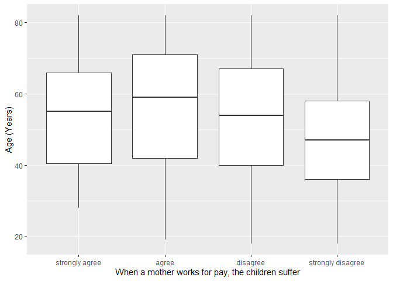
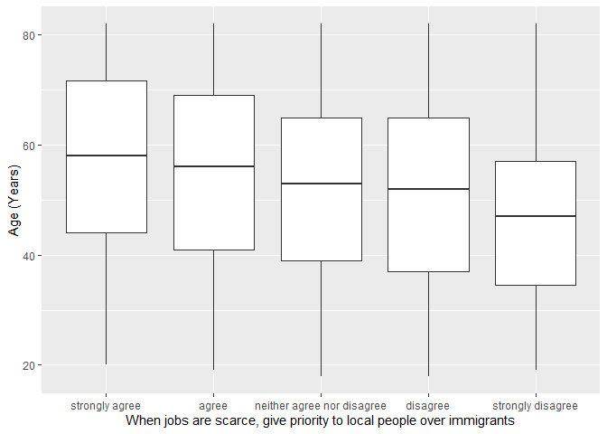

## Introduction

This is the report for the analysis on the [European Value Study (EVS) from 2017](https://search.gesis.org/research_data/ZA7500) which is a survey research program on how Europeans in Great Britain think about family, work, religion, politics, and society. We are mainly interested in Europeans thoughts on two questions:

1. When a mother works for pay, do Europeans think the children suffer?
2. When jobs are scarce, do Europeans think employers should give priority to local people over immigrants?

## Descriptives of variables

In the following table, the variables are:

1. `v72` represents the first question of interest (1-strongly agree, 2-agree, 3-disagree, or 4-strongly disagree)
2. `v80` represents the second question of interest (1-strongly agree, 2-agree, 3-neither agree nor disagree, 4-disagree, or 5-strongly disagree)
3. `sex` (1-male or 2-female)
4. `age` (years)
5. `education` (1-lower, 2-medium, or 3-higher)

-----------------------------------------------
      v72             v80             age      
--------------- --------------- ---------------
 Min.  :1.000    Min.  :1.000    Min.  :18.00  

 1st Qu.:3.000   1st Qu.:2.000   1st Qu.:39.00 

 Median :3.000   Median :3.000   Median :54.00 

  Mean :2.901     Mean :2.976     Mean :52.87  

 3rd Qu.:3.000   3rd Qu.:4.000   3rd Qu.:67.00 

 Max.  :4.000    Max.  :5.000    Max.  :82.00  
-----------------------------------------------

Table: Descriptive table for continuous variables

Table: Descriptive table for categorical variables

|Education | Sex|  Freq |
|:---------|---:|:------|
|Lower     |   M|267.00 |
|Medium    |   M|140.00 |
|Higher    |   M|358.00 |
|Lower     |   F|292.00 |
|Medium    |   F|163.00 |
|Higher    |   F|501.00 |

## Graphs

Boxplot for first question of interest (v72)

Boxplot for second question of interest (v80)

## Regression Analysis

### Model: v72 ~ age + $\sqrt{\text{age}}$ + sex + education

---------------------------------------------------------------------
        &nbsp;          Estimate    Std. Error   t value   Pr(>|t|)  
---------------------- ----------- ------------ --------- -----------
   **(Intercept)**        2.88        0.503       5.726    1.212e-08 

       **age**          -0.005346    0.01068     -0.5006    0.6167   

    **sqrt(age)**         0.02        0.1485     0.1347     0.8928   

    **sex-female**       0.05637     0.03393      1.661     0.0968   

 **education-medium**    0.1189      0.05099      2.332     0.01984  

 **education-higher**    0.2161      0.03977      5.435    6.275e-08 
---------------------------------------------------------------------

---------------------------------------------------------------
 Observations   Residual Std. Error    $R^2$    Adjusted $R^2$ 
-------------- --------------------- --------- ----------------
     1721             0.6974          0.03672      0.03391     
---------------------------------------------------------------

Table: Fitting linear model: v72 ~ age + sqrt(age) + sex + education

The coefficient estimate for `sex` is 0.056375 which means that the effect of a female respondent compared to a male is positive. The corresponding $p$-value is 0.096805 which is greater than or equal to 0.05. Thus, `sex` is not significant in the model.

### Model: v80 ~ age + $\sqrt{\text{age}}$ + sex + education

--------------------------------------------------------------------
        &nbsp;          Estimate   Std. Error   t value   Pr(>|t|)  
---------------------- ---------- ------------ --------- -----------
   **(Intercept)**       3.626       0.8253      4.394    1.183e-05 

       **age**          0.004272    0.01752     0.2438     0.8074   

    **sqrt(age)**       -0.1594      0.2436     -0.6544     0.513   

    **sex-female**      -0.06265    0.05568     -1.125     0.2606   

 **education-medium**    0.2203     0.08368      2.633    0.008534  

 **education-higher**    0.5257     0.06526      8.055    1.477e-15 
--------------------------------------------------------------------

---------------------------------------------------------------
 Observations   Residual Std. Error    $R^2$    Adjusted $R^2$ 
-------------- --------------------- --------- ----------------
     1721              1.145          0.06007      0.05733     
---------------------------------------------------------------

Table: Fitting linear model: v80 ~ age + sqrt(age) + sex + education

The coefficient estimate for `sex` is -0.0626542 which means that the effect of a female respondent compared to a male is negative. The corresponding $p$-value is 0.260648 which is greater than or equal to 0.05. Thus, `sex` is not significant in the model.

