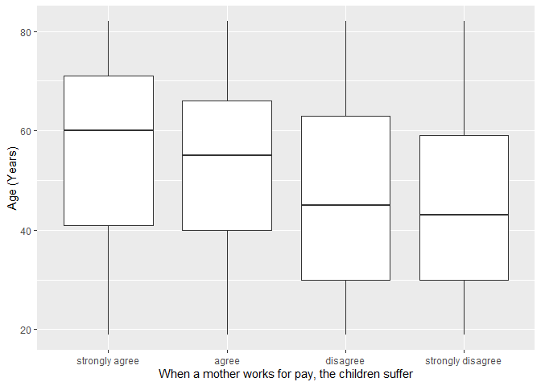
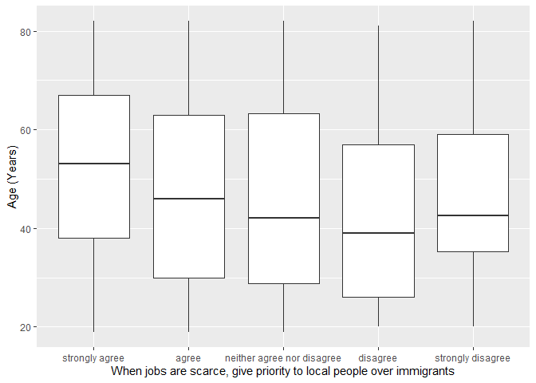

## Introduction

This is the report for the analysis on the [European Value Study (EVS) from 2017](https://search.gesis.org/research_data/ZA7500) which is a survey research program on how Europeans in Hungary think about family, work, religion, politics, and society. We are mainly interested in Europeans thoughts on two questions:

1. When a mother works for pay, do Europeans think the children suffer?
2. When jobs are scarce, do Europeans think employers should give priority to local people over immigrants?

## Descriptives of variables

In the following table, the variables are:

1. `v72` represents the first question of interest (1-strongly agree, 2-agree, 3-disagree, or 4-strongly disagree)
2. `v80` represents the second question of interest (1-strongly agree, 2-agree, 3-neither agree nor disagree, 4-disagree, or 5-strongly disagree)
3. `sex` (1-male or 2-female)
4. `age` (years)
5. `education` (1-lower, 2-medium, or 3-higher)

-----------------------------------------------
      v72             v80             age      
--------------- --------------- ---------------
 Min.  :1.000    Min.  :1.000    Min.  :19.00  

 1st Qu.:2.000   1st Qu.:1.000   1st Qu.:35.00 

 Median :3.000   Median :1.000   Median :50.00 

  Mean :2.561     Mean :1.645     Mean :49.87  

 3rd Qu.:3.000   3rd Qu.:2.000   3rd Qu.:65.00 

 Max.  :4.000    Max.  :5.000    Max.  :82.00  
-----------------------------------------------

Table: Descriptive table for continuous variables

Table: Descriptive table for categorical variables

|Education | Sex|   Freq|
|:---------|---:|------:|
|Lower     |   M|  83.00|
|Medium    |   M| 399.00|
|Higher    |   M| 146.00|
|Lower     |   F| 153.00|
|Medium    |   F| 445.00|
|Higher    |   F| 240.00|

## Graphs

Boxplot for first question of interest (v72)

Boxplot for second question of interest (v80)

## Regression Analysis

### Model: v72 ~ age + $\sqrt{\text{age}}$ + sex + education

--------------------------------------------------------------------
        &nbsp;          Estimate   Std. Error   t value   Pr(>|t|)  
---------------------- ---------- ------------ --------- -----------
   **(Intercept)**       3.206       0.5772      5.555    3.295e-08 

       **age**          0.006114    0.01319     0.4635     0.6431   

    **sqrt(age)**       -0.1902      0.1783     -1.066     0.2864   

    **sex-female**      0.06924     0.04573      1.514     0.1302   

 **education-medium**    0.3251     0.06567      4.95     8.28e-07  

 **education-higher**    0.5335     0.07391      7.218    8.427e-13 
--------------------------------------------------------------------

---------------------------------------------------------------
 Observations   Residual Std. Error    $R^2$    Adjusted $R^2$ 
-------------- --------------------- --------- ----------------
     1466             0.8578          0.07472      0.07155     
---------------------------------------------------------------

Table: Fitting linear model: v72 ~ age + sqrt(age) + sex + education

The coefficient estimate for `sex` is 0.0692413 which means that the effect of a female respondent compared to a male is positive. The corresponding $p$-value is 0.1302183 which is greater than or equal to 0.05. Thus, `sex` is not significant in the model.

### Model: v80 ~ age + $\sqrt{\text{age}}$ + sex + education

--------------------------------------------------------------------
        &nbsp;          Estimate   Std. Error   t value   Pr(>|t|)  
---------------------- ---------- ------------ --------- -----------
   **(Intercept)**       3.461       0.6523      5.307    1.288e-07 

       **age**          0.03125     0.01491      2.096     0.03622  

    **sqrt(age)**       -0.5158      0.2015     -2.559     0.01058  

    **sex-female**      0.05966     0.05168      1.154     0.2485   

 **education-medium**   0.07242     0.07422     0.9758     0.3293   

 **education-higher**    0.466      0.08352      5.579    2.871e-08 
--------------------------------------------------------------------

---------------------------------------------------------------
 Observations   Residual Std. Error    $R^2$    Adjusted $R^2$ 
-------------- --------------------- --------- ----------------
     1466             0.9694          0.05627      0.05304     
---------------------------------------------------------------

Table: Fitting linear model: v80 ~ age + sqrt(age) + sex + education

The coefficient estimate for `sex` is 0.0596617 which means that the effect of a female respondent compared to a male is positive. The corresponding $p$-value is 0.2485084 which is greater than or equal to 0.05. Thus, `sex` is not significant in the model.

