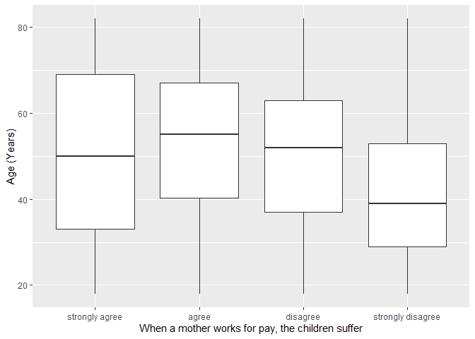
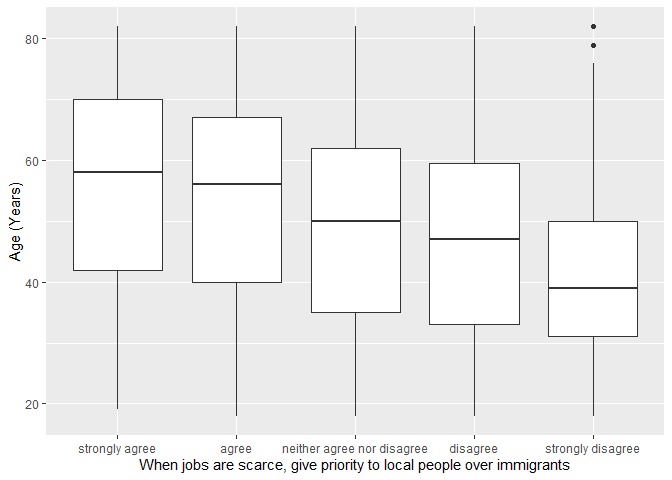

## Introduction

This is the report for the analysis on the [European Value Study (EVS) from 2017](https://search.gesis.org/research_data/ZA7500) which is a survey research program on how Europeans in Iceland think about family, work, religion, politics, and society. We are mainly interested in Europeans thoughts on two questions:

1. When a mother works for pay, do Europeans think the children suffer?
2. When jobs are scarce, do Europeans think employers should give priority to local people over immigrants?

## Descriptives of variables

In the following table, the variables are:

1. `v72` represents the first question of interest (1-strongly agree, 2-agree, 3-disagree, or 4-strongly disagree)
2. `v80` represents the second question of interest (1-strongly agree, 2-agree, 3-neither agree nor disagree, 4-disagree, or 5-strongly disagree)
3. `sex` (1-male or 2-female)
4. `age` (years)
5. `education` (1-lower, 2-medium, or 3-higher)

----------------------------------------------
      v72             v80            age      
--------------- --------------- --------------
 Min.  :1.000    Min.  :1.000    Min.  :18.0  

 1st Qu.:3.000   1st Qu.:2.000   1st Qu.:34.0 

 Median :3.000   Median :3.000   Median :49.0 

  Mean :3.051     Mean :3.257     Mean :48.5  

 3rd Qu.:4.000   3rd Qu.:4.000   3rd Qu.:62.0 

 Max.  :4.000    Max.  :5.000    Max.  :82.0  
----------------------------------------------

Table: Descriptive table for continuous variables

Table: Descriptive table for categorical variables

|Education | Sex|  Freq |
|:---------|---:|:------|
|Lower     |   M|155.00 |
|Medium    |   M|300.00 |
|Higher    |   M|297.00 |
|Lower     |   F|196.00 |
|Medium    |   F|230.00 |
|Higher    |   F|380.00 |

## Graphs

Boxplot for first question of interest (v72)

Boxplot for second question of interest (v80)

## Regression Analysis

### Model: v72 ~ age + $\sqrt{\text{age}}$ + sex + education

--------------------------------------------------------------------
        &nbsp;          Estimate   Std. Error   t value   Pr(>|t|)  
---------------------- ---------- ------------ --------- -----------
   **(Intercept)**       2.966       0.514       5.771    9.478e-09 

       **age**          -0.01649    0.01187     -1.389     0.1649   

    **sqrt(age)**       0.08568      0.1593     0.5379     0.5908   

    **sex-female**       0.1452     0.03676      3.95     8.168e-05 

 **education-medium**    0.1232     0.05017      2.455     0.01418  

 **education-higher**    0.4169     0.04991      8.352    1.468e-16 
--------------------------------------------------------------------

--------------------------------------------------------------
 Observations   Residual Std. Error   $R^2$    Adjusted $R^2$ 
-------------- --------------------- -------- ----------------
     1558             0.7179          0.1285       0.1257     
--------------------------------------------------------------

Table: Fitting linear model: v72 ~ age + sqrt(age) + sex + education

The coefficient estimate for `sex` is 0.1451908 which means that the effect of a female respondent compared to a male is positive. The corresponding $p$-value is 8.1675427\times 10^{-5} which is smaller than 0.05. Thus, `sex` is significant in the model.

### Model: v80 ~ age + $\sqrt{\text{age}}$ + sex + education

--------------------------------------------------------------------
        &nbsp;          Estimate   Std. Error   t value   Pr(>|t|)  
---------------------- ---------- ------------ --------- -----------
   **(Intercept)**       2.255       0.7859      2.869    0.004171  

       **age**          -0.04562    0.01815     -2.514     0.01205  

    **sqrt(age)**        0.4039      0.2436      1.658     0.09747  

    **sex-female**      0.07048     0.05621      1.254      0.21    

 **education-medium**    0.2382     0.07671      3.106    0.001932  

 **education-higher**    0.7617     0.07633      9.98     8.891e-23 
--------------------------------------------------------------------

--------------------------------------------------------------
 Observations   Residual Std. Error   $R^2$    Adjusted $R^2$ 
-------------- --------------------- -------- ----------------
     1558              1.098          0.1456       0.1429     
--------------------------------------------------------------

Table: Fitting linear model: v80 ~ age + sqrt(age) + sex + education

The coefficient estimate for `sex` is 0.0704828 which means that the effect of a female respondent compared to a male is positive. The corresponding $p$-value is 0.2100359 which is greater than or equal to 0.05. Thus, `sex` is not significant in the model.

