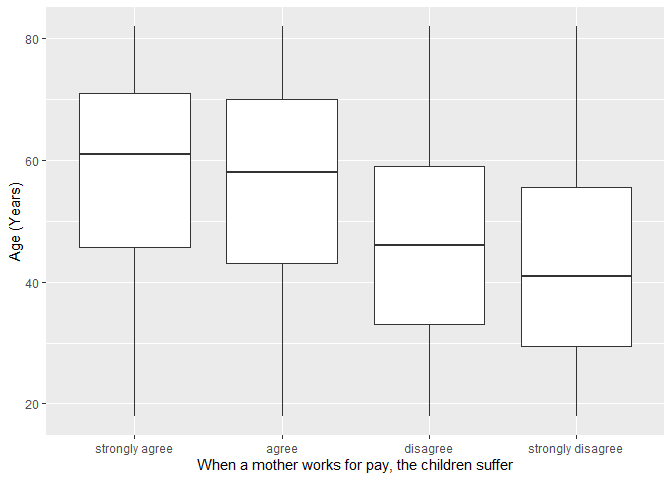
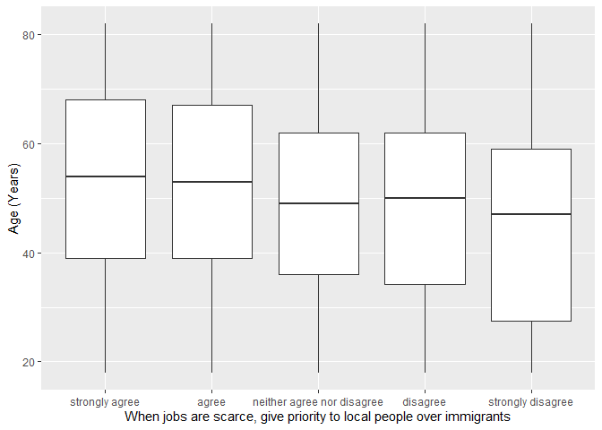

## Introduction

This is the report for the analysis on the [European Value Study (EVS) from 2017](https://search.gesis.org/research_data/ZA7500) which is a survey research program on how Europeans in Italy think about family, work, religion, politics, and society. We are mainly interested in Europeans thoughts on two questions:

1. When a mother works for pay, do Europeans think the children suffer?
2. When jobs are scarce, do Europeans think employers should give priority to local people over immigrants?

## Descriptives of variables

In the following table, the variables are:

1. `v72` represents the first question of interest (1-strongly agree, 2-agree, 3-disagree, or 4-strongly disagree)
2. `v80` represents the second question of interest (1-strongly agree, 2-agree, 3-neither agree nor disagree, 4-disagree, or 5-strongly disagree)
3. `sex` (1-male or 2-female)
4. `age` (years)
5. `education` (1-lower, 2-medium, or 3-higher)

-----------------------------------------------
      v72             v80             age      
--------------- --------------- ---------------
 Min.  :1.000    Min.  :1.000    Min.  :18.00  

 1st Qu.:2.000   1st Qu.:1.000   1st Qu.:37.00 

 Median :2.000   Median :2.000   Median :52.00 

  Mean :2.443     Mean :2.241     Mean :51.26  

 3rd Qu.:3.000   3rd Qu.:3.000   3rd Qu.:66.00 

 Max.  :4.000    Max.  :5.000    Max.  :82.00  
-----------------------------------------------

Table: Descriptive table for continuous variables

Table: Descriptive table for categorical variables

|Education | Sex|  Freq |
|:---------|---:|:------|
|Lower     |   M|424.00 |
|Medium    |   M|492.00 |
|Higher    |   M|166.00 |
|Lower     |   F|417.00 |
|Medium    |   F|484.00 |
|Higher    |   F|185.00 |

## Graphs

Boxplot for first question of interest (v72)

Boxplot for second question of interest (v80)

## Regression Analysis

### Model: v72 ~ age + $\sqrt{\text{age}}$ + sex + education

--------------------------------------------------------------------
        &nbsp;          Estimate   Std. Error   t value   Pr(>|t|)  
---------------------- ---------- ------------ --------- -----------
   **(Intercept)**       2.297       0.4227      5.435    6.091e-08 

       **age**          -0.02036    0.009521    -2.138     0.03262  

    **sqrt(age)**        0.1483      0.1289      1.15      0.2504   

    **sex-female**      -0.0327     0.03275     -0.9984    0.3182   

 **education-medium**    0.1921     0.03825      5.021    5.547e-07 

 **education-higher**    0.4702     0.05079      9.257    4.895e-20 
--------------------------------------------------------------------

--------------------------------------------------------------
 Observations   Residual Std. Error   $R^2$    Adjusted $R^2$ 
-------------- --------------------- -------- ----------------
     2168             0.7622          0.1112       0.1091     
--------------------------------------------------------------

Table: Fitting linear model: v72 ~ age + sqrt(age) + sex + education

The coefficient estimate for `sex` is -0.0327009 which means that the effect of a female respondent compared to a male is negative. The corresponding $p$-value is 0.3182075 which is greater than or equal to 0.05. Thus, `sex` is not significant in the model.

### Model: v80 ~ age + $\sqrt{\text{age}}$ + sex + education

--------------------------------------------------------------------
        &nbsp;          Estimate   Std. Error   t value   Pr(>|t|)  
---------------------- ---------- ------------ --------- -----------
   **(Intercept)**       2.483       0.6355      3.908    9.607e-05 

       **age**          0.00526     0.01432     0.3674     0.7133   

    **sqrt(age)**       -0.1105      0.1939     -0.5698    0.5689   

    **sex-female**      -0.1387     0.04925     -2.815    0.004915  

 **education-medium**    0.404      0.05751      7.025    2.858e-12 

 **education-higher**    0.9465     0.07637      12.39    3.982e-34 
--------------------------------------------------------------------

---------------------------------------------------------------
 Observations   Residual Std. Error    $R^2$    Adjusted $R^2$ 
-------------- --------------------- --------- ----------------
     2168              1.146          0.08438      0.08226     
---------------------------------------------------------------

Table: Fitting linear model: v80 ~ age + sqrt(age) + sex + education

The coefficient estimate for `sex` is -0.1386535 which means that the effect of a female respondent compared to a male is negative. The corresponding $p$-value is 0.0049147 which is smaller than 0.05. Thus, `sex` is significant in the model.

