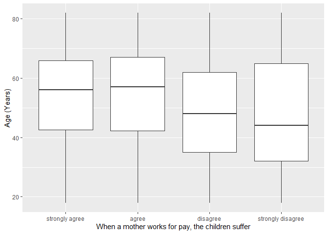
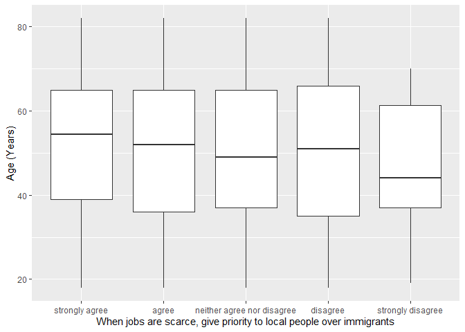

## Introduction

This is the report for the analysis on the [European Value Study (EVS) from 2017](https://search.gesis.org/research_data/ZA7500) which is a survey research program on how Europeans in Latvia think about family, work, religion, politics, and society. We are mainly interested in Europeans thoughts on two questions:

1. When a mother works for pay, do Europeans think the children suffer?
2. When jobs are scarce, do Europeans think employers should give priority to local people over immigrants?

## Descriptives of variables

In the following table, the variables are:

1. `v72` represents the first question of interest (1-strongly agree, 2-agree, 3-disagree, or 4-strongly disagree)
2. `v80` represents the second question of interest (1-strongly agree, 2-agree, 3-neither agree nor disagree, 4-disagree, or 5-strongly disagree)
3. `sex` (1-male or 2-female)
4. `age` (years)
5. `education` (1-lower, 2-medium, or 3-higher)

----------------------------------------------
      v72             v80            age      
--------------- --------------- --------------
 Min.  :1.000    Min.  :1.000    Min.  :18.0  

 1st Qu.:2.000   1st Qu.:1.000   1st Qu.:37.0 

 Median :3.000   Median :2.000   Median :52.5 

  Mean :2.499     Mean :1.893     Mean :51.5  

 3rd Qu.:3.000   3rd Qu.:3.000   3rd Qu.:65.0 

 Max.  :4.000    Max.  :5.000    Max.  :82.0  
----------------------------------------------

Table: Descriptive table for continuous variables

Table: Descriptive table for categorical variables

|Education | Sex|   Freq|
|:---------|---:|------:|
|Lower     |   M|  72.00|
|Medium    |   M| 223.00|
|Higher    |   M| 124.00|
|Lower     |   F|  98.00|
|Medium    |   F| 389.00|
|Higher    |   F| 346.00|

## Graphs

Boxplot for first question of interest (v72)

Boxplot for second question of interest (v80)

## Regression Analysis

### Model: v72 ~ age + $\sqrt{\text{age}}$ + sex + education

--------------------------------------------------------------------
        &nbsp;          Estimate   Std. Error   t value   Pr(>|t|)  
---------------------- ---------- ------------ --------- -----------
   **(Intercept)**       4.476       0.616       7.266    6.498e-13 

       **age**           0.031      0.01356      2.287     0.02239  

    **sqrt(age)**       -0.5162      0.186      -2.776    0.005591  

    **sex-female**      -0.1231     0.04569     -2.694    0.007155  

 **education-medium**    0.107      0.06545      1.634     0.1025   

 **education-higher**    0.2818     0.06901      4.084    4.716e-05 
--------------------------------------------------------------------

---------------------------------------------------------------
 Observations   Residual Std. Error    $R^2$    Adjusted $R^2$ 
-------------- --------------------- --------- ----------------
     1252             0.7447          0.05206      0.04825     
---------------------------------------------------------------

Table: Fitting linear model: v72 ~ age + sqrt(age) + sex + education

The coefficient estimate for `sex` is -0.123077 which means that the effect of a female respondent compared to a male is negative. The corresponding $p$-value is 0.0071552 which is smaller than 0.05. Thus, `sex` is significant in the model.

### Model: v80 ~ age + $\sqrt{\text{age}}$ + sex + education

--------------------------------------------------------------------
        &nbsp;          Estimate   Std. Error   t value   Pr(>|t|)  
---------------------- ---------- ------------ --------- -----------
   **(Intercept)**       2.937       0.8446      3.478    0.0005226 

       **age**           0.0153     0.01859     0.8232     0.4106   

    **sqrt(age)**       -0.2531      0.255      -0.9927    0.3211   

    **sex-female**      0.04881     0.06264     0.7792      0.436   

 **education-medium**   -0.1049     0.08975     -1.169     0.2425   

 **education-higher**   -0.06447    0.09463     -0.6813    0.4958   
--------------------------------------------------------------------

----------------------------------------------------------------
 Observations   Residual Std. Error    $R^2$     Adjusted $R^2$ 
-------------- --------------------- ---------- ----------------
     1252              1.021          0.004913      0.00092     
----------------------------------------------------------------

Table: Fitting linear model: v80 ~ age + sqrt(age) + sex + education

The coefficient estimate for `sex` is 0.0488104 which means that the effect of a female respondent compared to a male is positive. The corresponding $p$-value is 0.4360196 which is greater than or equal to 0.05. Thus, `sex` is not significant in the model.

