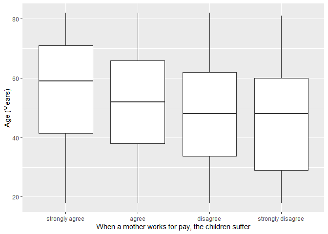
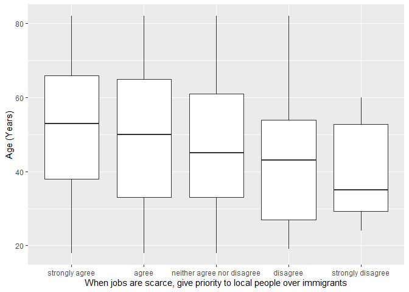

## Introduction

This is the report for the analysis on the [European Value Study (EVS) from 2017](https://search.gesis.org/research_data/ZA7500) which is a survey research program on how Europeans in Lithuania think about family, work, religion, politics, and society. We are mainly interested in Europeans thoughts on two questions:

1. When a mother works for pay, do Europeans think the children suffer?
2. When jobs are scarce, do Europeans think employers should give priority to local people over immigrants?

## Descriptives of variables

In the following table, the variables are:

1. `v72` represents the first question of interest (1-strongly agree, 2-agree, 3-disagree, or 4-strongly disagree)
2. `v80` represents the second question of interest (1-strongly agree, 2-agree, 3-neither agree nor disagree, 4-disagree, or 5-strongly disagree)
3. `sex` (1-male or 2-female)
4. `age` (years)
5. `education` (1-lower, 2-medium, or 3-higher)

-----------------------------------------------
      v72             v80             age      
--------------- --------------- ---------------
 Min.  :1.000    Min.  :1.000    Min.  :18.00  

 1st Qu.:2.000   1st Qu.:1.000   1st Qu.:35.75 

 Median :2.000   Median :1.000   Median :51.00 

  Mean :2.456     Mean :1.624     Mean :49.93  

 3rd Qu.:3.000   3rd Qu.:2.000   3rd Qu.:65.00 

 Max.  :4.000    Max.  :5.000    Max.  :82.00  
-----------------------------------------------

Table: Descriptive table for continuous variables

Table: Descriptive table for categorical variables

|Education | Sex|  Freq |
|:---------|---:|:------|
|Lower     |   M|107.00 |
|Medium    |   M|229.00 |
|Higher    |   M|176.00 |
|Lower     |   F|148.00 |
|Medium    |   F|333.00 |
|Higher    |   F|367.00 |

## Graphs

Boxplot for first question of interest (v72)

Boxplot for second question of interest (v80)

## Regression Analysis

### Model: v72 ~ age + $\sqrt{\text{age}}$ + sex + education

----------------------------------------------------------------------
        &nbsp;          Estimate    Std. Error   t value    Pr(>|t|)  
---------------------- ----------- ------------ ---------- -----------
   **(Intercept)**        2.724       0.5068      5.375     9.009e-08 

       **age**          7.744e-05    0.01182     0.006551    0.9948   

    **sqrt(age)**       -0.05903      0.1586     -0.3722     0.7098   

    **sex-female**      0.0005754    0.03949     0.01457     0.9884   

 **education-medium**    0.1711      0.05547      3.084     0.002081  

 **education-higher**    0.1677      0.05795      2.893     0.003873  
----------------------------------------------------------------------

---------------------------------------------------------------
 Observations   Residual Std. Error    $R^2$    Adjusted $R^2$ 
-------------- --------------------- --------- ----------------
     1360             0.6999          0.02355      0.01995     
---------------------------------------------------------------

Table: Fitting linear model: v72 ~ age + sqrt(age) + sex + education

The coefficient estimate for `sex` is 5.7540361\times 10^{-4} which means that the effect of a female respondent compared to a male is positive. The corresponding $p$-value is 0.9883761 which is greater than or equal to 0.05. Thus, `sex` is not significant in the model.

### Model: v80 ~ age + $\sqrt{\text{age}}$ + sex + education

--------------------------------------------------------------------
        &nbsp;          Estimate   Std. Error   t value   Pr(>|t|)  
---------------------- ---------- ------------ --------- -----------
   **(Intercept)**       2.377       0.5791      4.104    4.298e-05 

       **age**          0.00551     0.01351     0.4079     0.6834   

    **sqrt(age)**       -0.1497      0.1812     -0.8262    0.4088   

    **sex-female**       0.1028     0.04512      2.279     0.02282  

 **education-medium**   -0.1131     0.06339     -1.784     0.07461  

 **education-higher**   -0.01541    0.06622     -0.2327     0.816   
--------------------------------------------------------------------

---------------------------------------------------------------
 Observations   Residual Std. Error    $R^2$    Adjusted $R^2$ 
-------------- --------------------- --------- ----------------
     1360             0.7998          0.02153      0.01792     
---------------------------------------------------------------

Table: Fitting linear model: v80 ~ age + sqrt(age) + sex + education

The coefficient estimate for `sex` is 0.1028368 which means that the effect of a female respondent compared to a male is positive. The corresponding $p$-value is 0.0228201 which is smaller than 0.05. Thus, `sex` is significant in the model.

