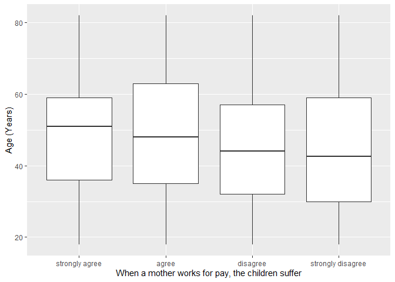
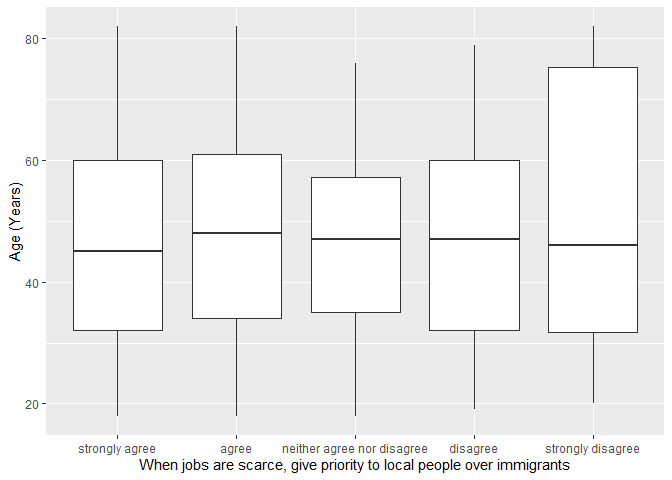

## Introduction

This is the report for the analysis on the [European Value Study (EVS) from 2017](https://search.gesis.org/research_data/ZA7500) which is a survey research program on how Europeans in Montenegro think about family, work, religion, politics, and society. We are mainly interested in Europeans thoughts on two questions:

1. When a mother works for pay, do Europeans think the children suffer?
2. When jobs are scarce, do Europeans think employers should give priority to local people over immigrants?

## Descriptives of variables

In the following table, the variables are:

1. `v72` represents the first question of interest (1-strongly agree, 2-agree, 3-disagree, or 4-strongly disagree)
2. `v80` represents the second question of interest (1-strongly agree, 2-agree, 3-neither agree nor disagree, 4-disagree, or 5-strongly disagree)
3. `sex` (1-male or 2-female)
4. `age` (years)
5. `education` (1-lower, 2-medium, or 3-higher)

-----------------------------------------------
      v72             v80             age      
--------------- --------------- ---------------
 Min.  :1.000    Min.  :1.000    Min.  :18.00  

 1st Qu.:2.000   1st Qu.:1.000   1st Qu.:34.00 

 Median :2.000   Median :2.000   Median :46.00 

  Mean :2.435     Mean :1.841     Mean :47.13  

 3rd Qu.:3.000   3rd Qu.:2.000   3rd Qu.:60.00 

 Max.  :4.000    Max.  :5.000    Max.  :82.00  
-----------------------------------------------

Table: Descriptive table for continuous variables

Table: Descriptive table for categorical variables

|Education | Sex|   Freq|
|:---------|---:|------:|
|Lower     |   M|  49.00|
|Medium    |   M| 292.00|
|Higher    |   M| 131.00|
|Lower     |   F|  70.00|
|Medium    |   F| 300.00|
|Higher    |   F| 111.00|

## Graphs

Boxplot for first question of interest (v72)

Boxplot for second question of interest (v80)

## Regression Analysis

### Model: v72 ~ age + $\sqrt{\text{age}}$ + sex + education

--------------------------------------------------------------------
        &nbsp;          Estimate   Std. Error   t value   Pr(>|t|)  
---------------------- ---------- ------------ --------- -----------
   **(Intercept)**       2.473       0.787       3.142    0.001727  

       **age**          0.002101    0.01792     0.1172     0.9067   

    **sqrt(age)**       -0.07121     0.2398     -0.2969    0.7666   

    **sex-female**       0.3243     0.05839      5.554    3.621e-08 

 **education-medium**    0.1859     0.09199      2.021     0.04357  

 **education-higher**    0.2545      0.104       2.447     0.01458  
--------------------------------------------------------------------

---------------------------------------------------------------
 Observations   Residual Std. Error    $R^2$    Adjusted $R^2$ 
-------------- --------------------- --------- ----------------
     953              0.8945          0.04365       0.0386     
---------------------------------------------------------------

Table: Fitting linear model: v72 ~ age + sqrt(age) + sex + education

The coefficient estimate for `sex` is 0.3243064 which means that the effect of a female respondent compared to a male is positive. The corresponding $p$-value is 3.6211288\times 10^{-8} which is smaller than 0.05. Thus, `sex` is significant in the model.

### Model: v80 ~ age + $\sqrt{\text{age}}$ + sex + education

---------------------------------------------------------------------
        &nbsp;          Estimate    Std. Error   t value    Pr(>|t|) 
---------------------- ----------- ------------ ---------- ----------
   **(Intercept)**        1.457       0.8024      1.816     0.06965  

       **age**          -0.005801    0.01827     -0.3175     0.7509  

    **sqrt(age)**        0.08794      0.2445      0.3597     0.7192  

    **sex-female**      -0.003363    0.05953     -0.05648    0.955   

 **education-medium**     0.098      0.09379      1.045      0.2964  

 **education-higher**    0.01565      0.106       0.1476     0.8827  
---------------------------------------------------------------------

----------------------------------------------------------------
 Observations   Residual Std. Error    $R^2$     Adjusted $R^2$ 
-------------- --------------------- ---------- ----------------
     953               0.912          0.002676      -0.00259    
----------------------------------------------------------------

Table: Fitting linear model: v80 ~ age + sqrt(age) + sex + education

The coefficient estimate for `sex` is -0.0033625 which means that the effect of a female respondent compared to a male is negative. The corresponding $p$-value is 0.9549683 which is greater than or equal to 0.05. Thus, `sex` is not significant in the model.

