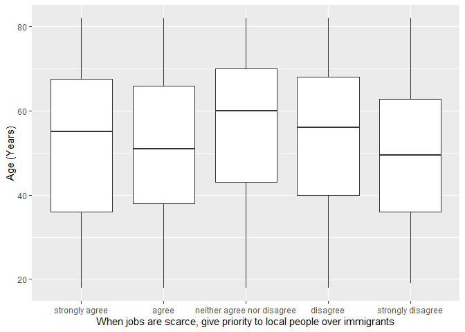

## Introduction

This is the report for the analysis on the [European Value Study (EVS) from 2017](https://search.gesis.org/research_data/ZA7500) which is a survey research program on how Europeans in Netherlands think about family, work, religion, politics, and society. We are mainly interested in Europeans thoughts on two questions:

1. When a mother works for pay, do Europeans think the children suffer?
2. When jobs are scarce, do Europeans think employers should give priority to local people over immigrants?

## Descriptives of variables

In the following table, the variables are:

1. `v72` represents the first question of interest (1-strongly agree, 2-agree, 3-disagree, or 4-strongly disagree)
2. `v80` represents the second question of interest (1-strongly agree, 2-agree, 3-neither agree nor disagree, 4-disagree, or 5-strongly disagree)
3. `sex` (1-male or 2-female)
4. `age` (years)
5. `education` (1-lower, 2-medium, or 3-higher)

-----------------------------------------------
      v72             v80             age      
--------------- --------------- ---------------
 Min.  :1.000    Min.  :1.000    Min.  :18.00  

 1st Qu.:3.000   1st Qu.:2.000   1st Qu.:39.00 

 Median :3.000   Median :3.000   Median :55.00 

  Mean :2.973     Mean :2.977     Mean :53.03  

 3rd Qu.:3.000   3rd Qu.:4.000   3rd Qu.:68.00 

 Max.  :4.000    Max.  :5.000    Max.  :82.00  
-----------------------------------------------

Table: Descriptive table for continuous variables

Table: Descriptive table for categorical variables

|Education | Sex|  Freq |
|:---------|---:|:------|
|Lower     |   M|294.00 |
|Medium    |   M|305.00 |
|Higher    |   M|471.00 |
|Lower     |   F|388.00 |
|Medium    |   F|326.00 |
|Higher    |   F|508.00 |

## Graphs

Boxplot for first question of interest (v72)

Boxplot for second question of interest (v80)

## Regression Analysis

### Model: v72 ~ age + $\sqrt{\text{age}}$ + sex + education

---------------------------------------------------------------------
        &nbsp;          Estimate    Std. Error   t value   Pr(>|t|)  
---------------------- ----------- ------------ --------- -----------
   **(Intercept)**        2.728       0.4307      6.332    2.898e-10 

       **age**          -0.007517    0.009322    -0.8064    0.4201   

    **sqrt(age)**        0.05151      0.1282      0.402     0.6877   

    **sex-female**       0.1557      0.02874      5.418    6.658e-08 

 **education-medium**    0.1497      0.03963      3.778    0.0001623 

 **education-higher**    0.3507      0.03577      9.804    2.96e-22  
---------------------------------------------------------------------

---------------------------------------------------------------
 Observations   Residual Std. Error    $R^2$    Adjusted $R^2$ 
-------------- --------------------- --------- ----------------
     2292             0.6842          0.07375      0.07173     
---------------------------------------------------------------

Table: Fitting linear model: v72 ~ age + sqrt(age) + sex + education

The coefficient estimate for `sex` is 0.1556933 which means that the effect of a female respondent compared to a male is positive. The corresponding $p$-value is 6.6579964\times 10^{-8} which is smaller than 0.05. Thus, `sex` is significant in the model.

### Model: v80 ~ age + $\sqrt{\text{age}}$ + sex + education

--------------------------------------------------------------------
        &nbsp;          Estimate   Std. Error   t value   Pr(>|t|)  
---------------------- ---------- ------------ --------- -----------
   **(Intercept)**       0.9566      0.7297      1.311      0.19    

       **age**          -0.0234     0.01579     -1.482     0.1384   

    **sqrt(age)**        0.3913      0.2171      1.802     0.07161  

    **sex-female**      0.04722     0.04868      0.97      0.3321   

 **education-medium**    0.3845     0.06713      5.728    1.15e-08  

 **education-higher**    0.7575      0.0606      12.5     9.919e-35 
--------------------------------------------------------------------

---------------------------------------------------------------
 Observations   Residual Std. Error    $R^2$    Adjusted $R^2$ 
-------------- --------------------- --------- ----------------
     2292              1.159          0.06779      0.06576     
---------------------------------------------------------------

Table: Fitting linear model: v80 ~ age + sqrt(age) + sex + education

The coefficient estimate for `sex` is 0.0472185 which means that the effect of a female respondent compared to a male is positive. The corresponding $p$-value is 0.3321343 which is greater than or equal to 0.05. Thus, `sex` is not significant in the model.

