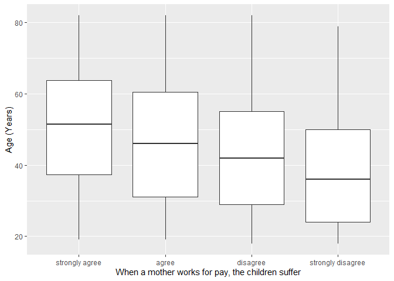
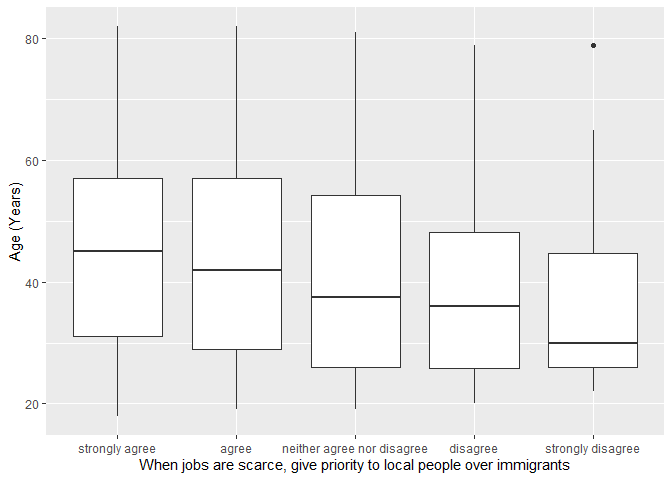

## Introduction

This is the report for the analysis on the [European Value Study (EVS) from 2017](https://search.gesis.org/research_data/ZA7500) which is a survey research program on how Europeans in North Macedonia think about family, work, religion, politics, and society. We are mainly interested in Europeans thoughts on two questions:

1. When a mother works for pay, do Europeans think the children suffer?
2. When jobs are scarce, do Europeans think employers should give priority to local people over immigrants?

## Descriptives of variables

In the following table, the variables are:

1. `v72` represents the first question of interest (1-strongly agree, 2-agree, 3-disagree, or 4-strongly disagree)
2. `v80` represents the second question of interest (1-strongly agree, 2-agree, 3-neither agree nor disagree, 4-disagree, or 5-strongly disagree)
3. `sex` (1-male or 2-female)
4. `age` (years)
5. `education` (1-lower, 2-medium, or 3-higher)

-----------------------------------------------
      v72             v80             age      
--------------- --------------- ---------------
 Min.  :1.000    Min.  :1.000    Min.  :18.00  

 1st Qu.:2.000   1st Qu.:1.000   1st Qu.:29.00 

 Median :3.000   Median :1.000   Median :43.00 

  Mean :2.718     Mean :1.789     Mean :43.86  

 3rd Qu.:3.000   3rd Qu.:2.000   3rd Qu.:56.00 

 Max.  :4.000    Max.  :5.000    Max.  :82.00  
-----------------------------------------------

Table: Descriptive table for continuous variables

Table: Descriptive table for categorical variables

|Education | Sex|   Freq|
|:---------|---:|------:|
|Lower     |   M|  77.00|
|Medium    |   M| 276.00|
|Higher    |   M| 161.00|
|Lower     |   F| 104.00|
|Medium    |   F| 213.00|
|Higher    |   F| 205.00|

## Graphs

Boxplot for first question of interest (v72)

Boxplot for second question of interest (v80)

## Regression Analysis

### Model: v72 ~ age + $\sqrt{\text{age}}$ + sex + education

--------------------------------------------------------------------
        &nbsp;          Estimate   Std. Error   t value   Pr(>|t|)  
---------------------- ---------- ------------ --------- -----------
   **(Intercept)**       3.426       0.6972      4.914    1.039e-06 

       **age**          0.01508     0.01702     0.8862     0.3757   

    **sqrt(age)**       -0.2694      0.2216     -1.215     0.2245   

    **sex-female**      0.05034     0.05136     0.9802     0.3272   

 **education-medium**    0.4079     0.07785      5.239    1.956e-07 

 **education-higher**    0.4628     0.08215      5.633    2.281e-08 
--------------------------------------------------------------------

---------------------------------------------------------------
 Observations   Residual Std. Error    $R^2$    Adjusted $R^2$ 
-------------- --------------------- --------- ----------------
     1036             0.8194          0.06507      0.06053     
---------------------------------------------------------------

Table: Fitting linear model: v72 ~ age + sqrt(age) + sex + education

The coefficient estimate for `sex` is 0.0503402 which means that the effect of a female respondent compared to a male is positive. The corresponding $p$-value is 0.3272308 which is greater than or equal to 0.05. Thus, `sex` is not significant in the model.

### Model: v80 ~ age + $\sqrt{\text{age}}$ + sex + education

--------------------------------------------------------------------
        &nbsp;          Estimate   Std. Error   t value   Pr(>|t|)  
---------------------- ---------- ------------ --------- -----------
   **(Intercept)**       3.651       0.834       4.377    1.324e-05 

       **age**          0.03691     0.02036      1.813     0.07017  

    **sqrt(age)**       -0.5588      0.2651     -2.108     0.0353   

    **sex-female**      0.01039     0.06143     0.1692     0.8657   

 **education-medium**    0.1257     0.09313      1.35      0.1774   

 **education-higher**    0.2437     0.09827      2.48      0.0133   
--------------------------------------------------------------------

---------------------------------------------------------------
 Observations   Residual Std. Error    $R^2$    Adjusted $R^2$ 
-------------- --------------------- --------- ----------------
     1036             0.9802          0.02286      0.01811     
---------------------------------------------------------------

Table: Fitting linear model: v80 ~ age + sqrt(age) + sex + education

The coefficient estimate for `sex` is 0.0103945 which means that the effect of a female respondent compared to a male is positive. The corresponding $p$-value is 0.8656762 which is greater than or equal to 0.05. Thus, `sex` is not significant in the model.

