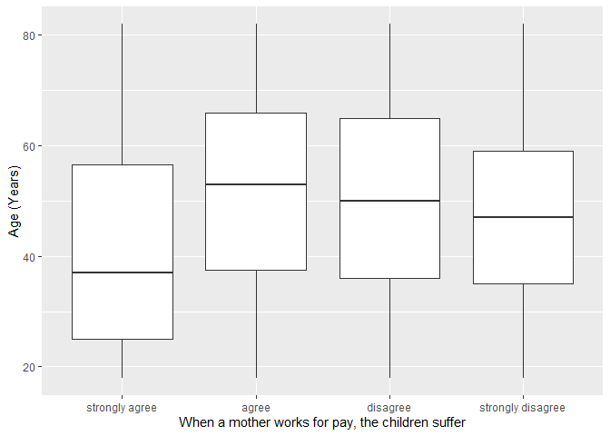
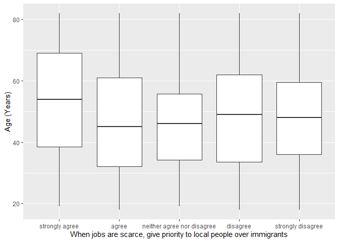

## Introduction

This is the report for the analysis on the [European Value Study (EVS) from 2017](https://search.gesis.org/research_data/ZA7500) which is a survey research program on how Europeans in Norway think about family, work, religion, politics, and society. We are mainly interested in Europeans thoughts on two questions:

1. When a mother works for pay, do Europeans think the children suffer?
2. When jobs are scarce, do Europeans think employers should give priority to local people over immigrants?

## Descriptives of variables

In the following table, the variables are:

1. `v72` represents the first question of interest (1-strongly agree, 2-agree, 3-disagree, or 4-strongly disagree)
2. `v80` represents the second question of interest (1-strongly agree, 2-agree, 3-neither agree nor disagree, 4-disagree, or 5-strongly disagree)
3. `sex` (1-male or 2-female)
4. `age` (years)
5. `education` (1-lower, 2-medium, or 3-higher)

---------------------------------------------
     v72            v80             age      
------------- --------------- ---------------
 Min.  :1.0    Min.  :1.000    Min.  :18.00  

 1st Qu.:3.0   1st Qu.:2.000   1st Qu.:35.00 

 Median :4.0   Median :4.000   Median :48.00 

  Mean :3.3     Mean :3.549     Mean :48.47  

 3rd Qu.:4.0   3rd Qu.:5.000   3rd Qu.:62.00 

 Max.  :4.0    Max.  :5.000    Max.  :82.00  
---------------------------------------------

Table: Descriptive table for continuous variables

Table: Descriptive table for categorical variables

|Education | Sex|   Freq|
|:---------|---:|------:|
|Lower     |   M|  93.00|
|Medium    |   M| 213.00|
|Higher    |   M| 224.00|
|Lower     |   F|  99.00|
|Medium    |   F| 180.00|
|Higher    |   F| 284.00|

## Graphs

Boxplot for first question of interest (v72)

Boxplot for second question of interest (v80)

## Regression Analysis

### Model: v72 ~ age + $\sqrt{\text{age}}$ + sex + education

--------------------------------------------------------------------
        &nbsp;          Estimate   Std. Error   t value   Pr(>|t|)  
---------------------- ---------- ------------ --------- -----------
   **(Intercept)**        0.98       0.7364      1.331     0.1835   

       **age**          -0.05013    0.01684     -2.978    0.002969  

    **sqrt(age)**        0.6476      0.2272      2.85     0.004456  

    **sex-female**      0.08954     0.05415      1.654     0.09851  

 **education-medium**    0.2134      0.0796      2.681    0.007455  

 **education-higher**     0.42      0.07878      5.331    1.185e-07 
--------------------------------------------------------------------

---------------------------------------------------------------
 Observations   Residual Std. Error    $R^2$    Adjusted $R^2$ 
-------------- --------------------- --------- ----------------
     1093             0.8896          0.05217      0.04781     
---------------------------------------------------------------

Table: Fitting linear model: v72 ~ age + sqrt(age) + sex + education

The coefficient estimate for `sex` is 0.0895361 which means that the effect of a female respondent compared to a male is positive. The corresponding $p$-value is 0.0985072 which is greater than or equal to 0.05. Thus, `sex` is not significant in the model.

### Model: v80 ~ age + $\sqrt{\text{age}}$ + sex + education

--------------------------------------------------------------------
        &nbsp;          Estimate   Std. Error   t value   Pr(>|t|)  
---------------------- ---------- ------------ --------- -----------
   **(Intercept)**       0.4823      1.193      0.4042     0.6862   

       **age**          -0.06168    0.02728     -2.261     0.02396  

    **sqrt(age)**        0.8022      0.3682      2.179     0.02956  

    **sex-female**       0.199      0.08774      2.268     0.02352  

 **education-medium**    0.4153      0.129       3.22     0.001321  

 **education-higher**    0.6757      0.1277      5.293    1.456e-07 
--------------------------------------------------------------------

---------------------------------------------------------------
 Observations   Residual Std. Error    $R^2$    Adjusted $R^2$ 
-------------- --------------------- --------- ----------------
     1093              1.442          0.04553      0.04114     
---------------------------------------------------------------

Table: Fitting linear model: v80 ~ age + sqrt(age) + sex + education

The coefficient estimate for `sex` is 0.1990069 which means that the effect of a female respondent compared to a male is positive. The corresponding $p$-value is 0.0235236 which is smaller than 0.05. Thus, `sex` is significant in the model.

