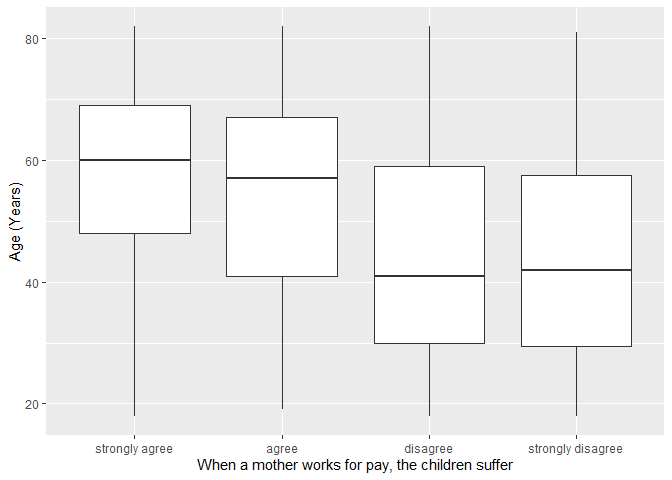
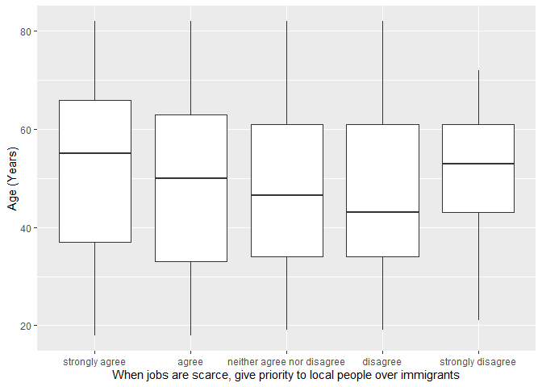

## Introduction

This is the report for the analysis on the [European Value Study (EVS) from 2017](https://search.gesis.org/research_data/ZA7500) which is a survey research program on how Europeans in Poland think about family, work, religion, politics, and society. We are mainly interested in Europeans thoughts on two questions:

1. When a mother works for pay, do Europeans think the children suffer?
2. When jobs are scarce, do Europeans think employers should give priority to local people over immigrants?

## Descriptives of variables

In the following table, the variables are:

1. `v72` represents the first question of interest (1-strongly agree, 2-agree, 3-disagree, or 4-strongly disagree)
2. `v80` represents the second question of interest (1-strongly agree, 2-agree, 3-neither agree nor disagree, 4-disagree, or 5-strongly disagree)
3. `sex` (1-male or 2-female)
4. `age` (years)
5. `education` (1-lower, 2-medium, or 3-higher)

-----------------------------------------------
      v72             v80             age      
--------------- --------------- ---------------
 Min.  :1.000    Min.  :1.000    Min.  :18.00  

 1st Qu.:2.000   1st Qu.:1.000   1st Qu.:34.00 

 Median :2.000   Median :2.000   Median :51.00 

  Mean :2.434     Mean :2.101     Mean :49.63  

 3rd Qu.:3.000   3rd Qu.:3.000   3rd Qu.:64.00 

 Max.  :4.000    Max.  :5.000    Max.  :82.00  
-----------------------------------------------

Table: Descriptive table for continuous variables

Table: Descriptive table for categorical variables

|Education | Sex|  Freq |
|:---------|---:|:------|
|Lower     |   M|231.00 |
|Medium    |   M|213.00 |
|Higher    |   M|134.00 |
|Lower     |   F|210.00 |
|Medium    |   F|274.00 |
|Higher    |   F|218.00 |

## Graphs

Boxplot for first question of interest (v72)

Boxplot for second question of interest (v80)

## Regression Analysis

### Model: v72 ~ age + $\sqrt{\text{age}}$ + sex + education

--------------------------------------------------------------------
        &nbsp;          Estimate   Std. Error   t value   Pr(>|t|)  
---------------------- ---------- ------------ --------- -----------
   **(Intercept)**       3.644       0.5729      6.361    2.79e-10  

       **age**          0.009803    0.01297     0.7556      0.45    

    **sqrt(age)**       -0.2866      0.1747     -1.641      0.101   

    **sex-female**      0.05002     0.04186      1.195     0.2324   

 **education-medium**    0.2566     0.04988      5.144    3.116e-07 

 **education-higher**    0.5942     0.05507      10.79    4.986e-26 
--------------------------------------------------------------------

--------------------------------------------------------------
 Observations   Residual Std. Error   $R^2$    Adjusted $R^2$ 
-------------- --------------------- -------- ----------------
     1280             0.7369          0.1788       0.1756     
--------------------------------------------------------------

Table: Fitting linear model: v72 ~ age + sqrt(age) + sex + education

The coefficient estimate for `sex` is 0.0500217 which means that the effect of a female respondent compared to a male is positive. The corresponding $p$-value is 0.232367 which is greater than or equal to 0.05. Thus, `sex` is not significant in the model.

### Model: v80 ~ age + $\sqrt{\text{age}}$ + sex + education

--------------------------------------------------------------------
        &nbsp;          Estimate   Std. Error   t value   Pr(>|t|)  
---------------------- ---------- ------------ --------- -----------
   **(Intercept)**      -0.5289      0.8324     -0.6355    0.5252   

       **age**          -0.05574    0.01885     -2.957    0.003163  

    **sqrt(age)**        0.7343      0.2538      2.893    0.003875  

    **sex-female**      -0.05717    0.06083     -0.9399    0.3474   

 **education-medium**    0.2993     0.07248      4.129    3.879e-05 

 **education-higher**    0.8356     0.08002      10.44    1.493e-24 
--------------------------------------------------------------------

---------------------------------------------------------------
 Observations   Residual Std. Error    $R^2$    Adjusted $R^2$ 
-------------- --------------------- --------- ----------------
     1280              1.071          0.09845      0.09491     
---------------------------------------------------------------

Table: Fitting linear model: v80 ~ age + sqrt(age) + sex + education

The coefficient estimate for `sex` is -0.0571737 which means that the effect of a female respondent compared to a male is negative. The corresponding $p$-value is 0.34743 which is greater than or equal to 0.05. Thus, `sex` is not significant in the model.

