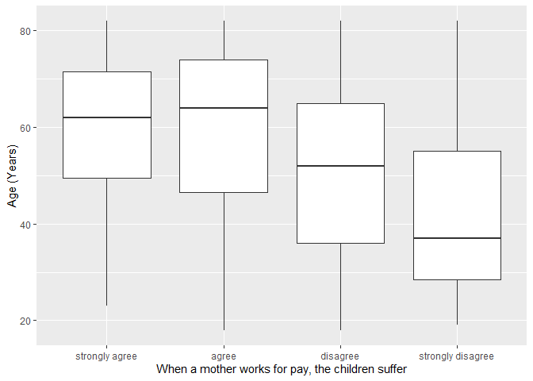
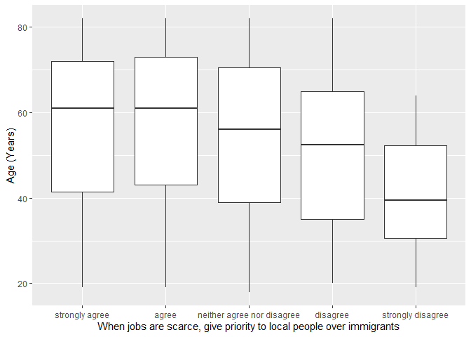

## Introduction

This is the report for the analysis on the [European Value Study (EVS) from 2017](https://search.gesis.org/research_data/ZA7500) which is a survey research program on how Europeans in Portugal think about family, work, religion, politics, and society. We are mainly interested in Europeans thoughts on two questions:

1. When a mother works for pay, do Europeans think the children suffer?
2. When jobs are scarce, do Europeans think employers should give priority to local people over immigrants?

## Descriptives of variables

In the following table, the variables are:

1. `v72` represents the first question of interest (1-strongly agree, 2-agree, 3-disagree, or 4-strongly disagree)
2. `v80` represents the second question of interest (1-strongly agree, 2-agree, 3-neither agree nor disagree, 4-disagree, or 5-strongly disagree)
3. `sex` (1-male or 2-female)
4. `age` (years)
5. `education` (1-lower, 2-medium, or 3-higher)

---------------------------------------------
      v72            v80            age      
--------------- ------------- ---------------
 Min.  :1.000    Min.  :1.0    Min.  :18.00  

 1st Qu.:2.000   1st Qu.:2.0   1st Qu.:40.00 

 Median :2.000   Median :2.0   Median :58.00 

  Mean :2.503     Mean :2.4     Mean :55.04  

 3rd Qu.:3.000   3rd Qu.:3.0   3rd Qu.:71.00 

 Max.  :4.000    Max.  :5.0    Max.  :82.00  
---------------------------------------------

Table: Descriptive table for continuous variables

Table: Descriptive table for categorical variables

|Education | Sex|  Freq |
|:---------|---:|:------|
|Lower     |   M|287.00 |
|Medium    |   M|114.00 |
|Higher    |   M| 87.00 |
|Lower     |   F|434.00 |
|Medium    |   F|157.00 |
|Higher    |   F| 91.00 |

## Graphs

Boxplot for first question of interest (v72)

Boxplot for second question of interest (v80)

## Regression Analysis

### Model: v72 ~ age + $\sqrt{\text{age}}$ + sex + education

--------------------------------------------------------------------
        &nbsp;          Estimate   Std. Error   t value   Pr(>|t|)  
---------------------- ---------- ------------ --------- -----------
   **(Intercept)**       4.044       0.583       6.936    6.668e-12 

       **age**          0.01828     0.01219      1.499     0.1341   

    **sqrt(age)**       -0.3636      0.1703     -2.136     0.03292  

    **sex-female**      0.01426     0.04073     0.3501     0.7263   

 **education-medium**    0.1694     0.05711      2.966    0.003083  

 **education-higher**    0.3966     0.06373      6.223    6.801e-10 
--------------------------------------------------------------------

--------------------------------------------------------------
 Observations   Residual Std. Error   $R^2$    Adjusted $R^2$ 
-------------- --------------------- -------- ----------------
     1170             0.6852          0.1163       0.1125     
--------------------------------------------------------------

Table: Fitting linear model: v72 ~ age + sqrt(age) + sex + education

The coefficient estimate for `sex` is 0.0142587 which means that the effect of a female respondent compared to a male is positive. The corresponding $p$-value is 0.7263265 which is greater than or equal to 0.05. Thus, `sex` is not significant in the model.

### Model: v80 ~ age + $\sqrt{\text{age}}$ + sex + education

-----------------------------------------------------------------------
        &nbsp;          Estimate    Std. Error    t value    Pr(>|t|)  
---------------------- ----------- ------------ ----------- -----------
   **(Intercept)**        2.547       0.9264       2.749     0.006072  

       **age**          1.445e-05    0.01937     0.0007457    0.9994   

    **sqrt(age)**       -0.04531      0.2706      -0.1675      0.867   

    **sex-female**       0.02332     0.06472      0.3604      0.7186   

 **education-medium**    0.2892      0.09076       3.186     0.001481  

 **education-higher**    0.6763       0.1013       6.678     3.741e-11 
-----------------------------------------------------------------------

---------------------------------------------------------------
 Observations   Residual Std. Error    $R^2$    Adjusted $R^2$ 
-------------- --------------------- --------- ----------------
     1170              1.089          0.06165      0.05762     
---------------------------------------------------------------

Table: Fitting linear model: v80 ~ age + sqrt(age) + sex + education

The coefficient estimate for `sex` is 0.0233218 which means that the effect of a female respondent compared to a male is positive. The corresponding $p$-value is 0.7186468 which is greater than or equal to 0.05. Thus, `sex` is not significant in the model.

