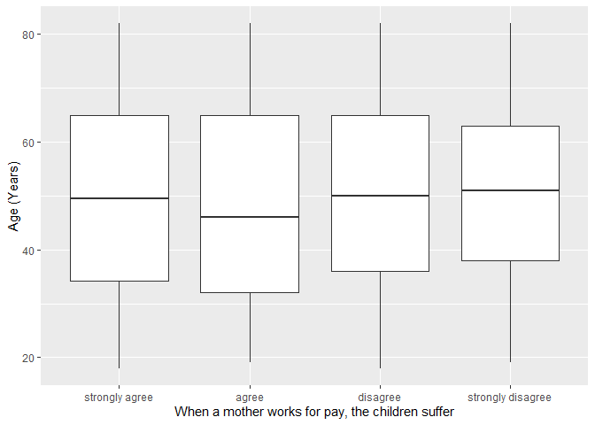
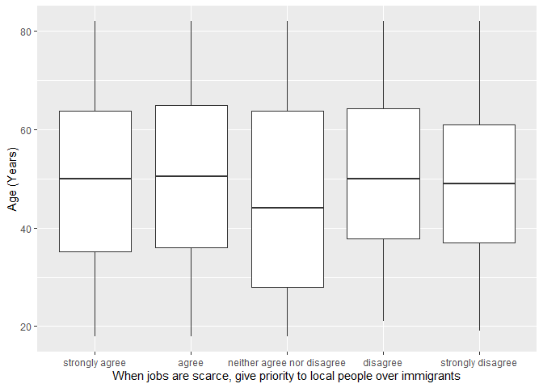

## Introduction

This is the report for the analysis on the [European Value Study (EVS) from 2017](https://search.gesis.org/research_data/ZA7500) which is a survey research program on how Europeans in Romania think about family, work, religion, politics, and society. We are mainly interested in Europeans thoughts on two questions:

1. When a mother works for pay, do Europeans think the children suffer?
2. When jobs are scarce, do Europeans think employers should give priority to local people over immigrants?

## Descriptives of variables

In the following table, the variables are:

1. `v72` represents the first question of interest (1-strongly agree, 2-agree, 3-disagree, or 4-strongly disagree)
2. `v80` represents the second question of interest (1-strongly agree, 2-agree, 3-neither agree nor disagree, 4-disagree, or 5-strongly disagree)
3. `sex` (1-male or 2-female)
4. `age` (years)
5. `education` (1-lower, 2-medium, or 3-higher)

-----------------------------------------------
      v72             v80             age      
--------------- --------------- ---------------
 Min.  :1.000    Min.  :1.000    Min.  :18.00  

 1st Qu.:2.000   1st Qu.:1.000   1st Qu.:35.00 

 Median :3.000   Median :2.000   Median :50.00 

  Mean :2.683     Mean :1.908     Mean :49.34  

 3rd Qu.:3.000   3rd Qu.:2.000   3rd Qu.:64.00 

 Max.  :4.000    Max.  :5.000    Max.  :82.00  
-----------------------------------------------

Table: Descriptive table for continuous variables

Table: Descriptive table for categorical variables

|Education | Sex|  Freq |
|:---------|---:|:------|
|Lower     |   M|184.00 |
|Medium    |   M|372.00 |
|Higher    |   M|105.00 |
|Lower     |   F|257.00 |
|Medium    |   F|359.00 |
|Higher    |   F|172.00 |

## Graphs

Boxplot for first question of interest (v72)

Boxplot for second question of interest (v80)

## Regression Analysis

### Model: v72 ~ age + $\sqrt{\text{age}}$ + sex + education

-------------------------------------------------------------------
        &nbsp;          Estimate   Std. Error   t value   Pr(>|t|) 
---------------------- ---------- ------------ --------- ----------
   **(Intercept)**       1.831       0.644       2.843    0.004534 

       **age**          -0.01328    0.01491     -0.8908    0.3732  

    **sqrt(age)**        0.2041      0.1996      1.022     0.3067  

    **sex-female**      0.04381     0.04841     0.9048     0.3657  

 **education-medium**    0.0826     0.05666      1.458     0.1451  

 **education-higher**    0.1735     0.07276      2.385    0.01722  
-------------------------------------------------------------------

----------------------------------------------------------------
 Observations   Residual Std. Error    $R^2$     Adjusted $R^2$ 
-------------- --------------------- ---------- ----------------
     1449             0.9119          0.006703      0.003261    
----------------------------------------------------------------

Table: Fitting linear model: v72 ~ age + sqrt(age) + sex + education

The coefficient estimate for `sex` is 0.0438067 which means that the effect of a female respondent compared to a male is positive. The corresponding $p$-value is 0.365703 which is greater than or equal to 0.05. Thus, `sex` is not significant in the model.

### Model: v80 ~ age + $\sqrt{\text{age}}$ + sex + education

--------------------------------------------------------------------
        &nbsp;          Estimate   Std. Error   t value   Pr(>|t|)  
---------------------- ---------- ------------ --------- -----------
   **(Intercept)**       2.844       0.7393      3.848    0.0001245 

       **age**          0.01975     0.01712      1.154     0.2487   

    **sqrt(age)**       -0.2852      0.2292     -1.244     0.2136   

    **sex-female**      0.09162     0.05558      1.649     0.09944  

 **education-medium**   -0.06037    0.06504     -0.9283    0.3534   

 **education-higher**    0.1969     0.08352      2.357     0.01855  
--------------------------------------------------------------------

---------------------------------------------------------------
 Observations   Residual Std. Error    $R^2$    Adjusted $R^2$ 
-------------- --------------------- --------- ----------------
     1449              1.047          0.01231      0.008888    
---------------------------------------------------------------

Table: Fitting linear model: v80 ~ age + sqrt(age) + sex + education

The coefficient estimate for `sex` is 0.0916222 which means that the effect of a female respondent compared to a male is positive. The corresponding $p$-value is 0.0994435 which is greater than or equal to 0.05. Thus, `sex` is not significant in the model.

