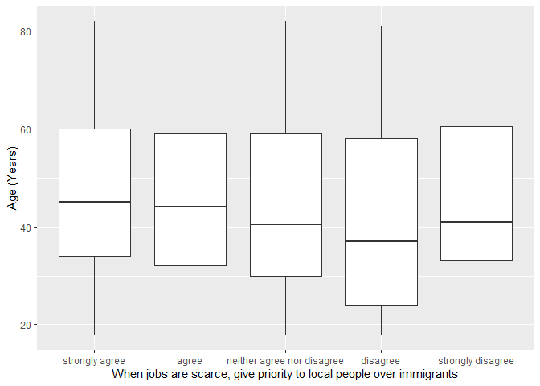

## Introduction

This is the report for the analysis on the [European Value Study (EVS) from 2017](https://search.gesis.org/research_data/ZA7500) which is a survey research program on how Europeans in Russia think about family, work, religion, politics, and society. We are mainly interested in Europeans thoughts on two questions:

1. When a mother works for pay, do Europeans think the children suffer?
2. When jobs are scarce, do Europeans think employers should give priority to local people over immigrants?

## Descriptives of variables

In the following table, the variables are:

1. `v72` represents the first question of interest (1-strongly agree, 2-agree, 3-disagree, or 4-strongly disagree)
2. `v80` represents the second question of interest (1-strongly agree, 2-agree, 3-neither agree nor disagree, 4-disagree, or 5-strongly disagree)
3. `sex` (1-male or 2-female)
4. `age` (years)
5. `education` (1-lower, 2-medium, or 3-higher)

----------------------------------------------
      v72            v80             age      
--------------- -------------- ---------------
 Min.  :1.000    Min.  :1.00    Min.  :18.00  

 1st Qu.:2.000   1st Qu.:1.00   1st Qu.:32.00 

 Median :3.000   Median :2.00   Median :43.00 

  Mean :2.523     Mean :1.87     Mean :45.71  

 3rd Qu.:3.000   3rd Qu.:2.00   3rd Qu.:59.00 

 Max.  :4.000    Max.  :5.00    Max.  :82.00  
----------------------------------------------

Table: Descriptive table for continuous variables

Table: Descriptive table for categorical variables

|Education | Sex|  Freq |
|:---------|---:|:------|
|Lower     |   M|100.00 |
|Medium    |   M|173.00 |
|Higher    |   M|456.00 |
|Lower     |   F|125.00 |
|Medium    |   F|206.00 |
|Higher    |   F|651.00 |

## Graphs

Boxplot for first question of interest (v72)

Boxplot for second question of interest (v80)

## Regression Analysis

### Model: v72 ~ age + $\sqrt{\text{age}}$ + sex + education

--------------------------------------------------------------------
        &nbsp;          Estimate    Std. Error   t value   Pr(>|t|) 
---------------------- ----------- ------------ --------- ----------
   **(Intercept)**        2.32        0.5316      4.365    1.35e-05 

       **age**          -0.007653    0.01251     -0.6116    0.5409  

    **sqrt(age)**        0.06591      0.1664      0.396     0.6921  

    **sex-female**      0.003659     0.04037     0.09063    0.9278  

 **education-medium**    0.1482      0.07001      2.117     0.0344  

 **education-higher**    0.1233      0.06291      1.961     0.0501  
--------------------------------------------------------------------

----------------------------------------------------------------
 Observations   Residual Std. Error    $R^2$     Adjusted $R^2$ 
-------------- --------------------- ---------- ----------------
     1711             0.8184          0.007728      0.004818    
----------------------------------------------------------------

Table: Fitting linear model: v72 ~ age + sqrt(age) + sex + education

The coefficient estimate for `sex` is 0.0036592 which means that the effect of a female respondent compared to a male is positive. The corresponding $p$-value is 0.9277943 which is greater than or equal to 0.05. Thus, `sex` is not significant in the model.

### Model: v80 ~ age + $\sqrt{\text{age}}$ + sex + education

--------------------------------------------------------------------
        &nbsp;          Estimate   Std. Error   t value   Pr(>|t|)  
---------------------- ---------- ------------ --------- -----------
   **(Intercept)**       4.404       0.681       6.466    1.308e-10 

       **age**           0.0447     0.01603      2.789    0.005347  

    **sqrt(age)**       -0.6749      0.2132     -3.166    0.001574  

    **sex-female**      0.01311     0.05172     0.2534       0.8    

 **education-medium**    -0.073     0.08969     -0.8139    0.4158   

 **education-higher**   -0.1367     0.08059     -1.697     0.08994  
--------------------------------------------------------------------

---------------------------------------------------------------
 Observations   Residual Std. Error    $R^2$    Adjusted $R^2$ 
-------------- --------------------- --------- ----------------
     1711              1.048          0.01736      0.01447     
---------------------------------------------------------------

Table: Fitting linear model: v80 ~ age + sqrt(age) + sex + education

The coefficient estimate for `sex` is 0.0131062 which means that the effect of a female respondent compared to a male is positive. The corresponding $p$-value is 0.7999841 which is greater than or equal to 0.05. Thus, `sex` is not significant in the model.

