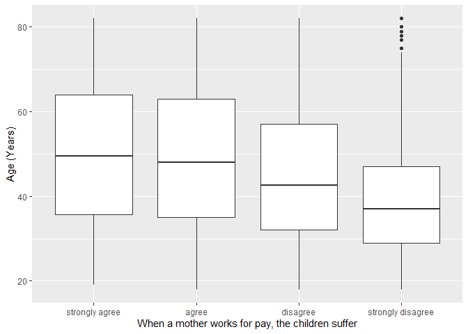
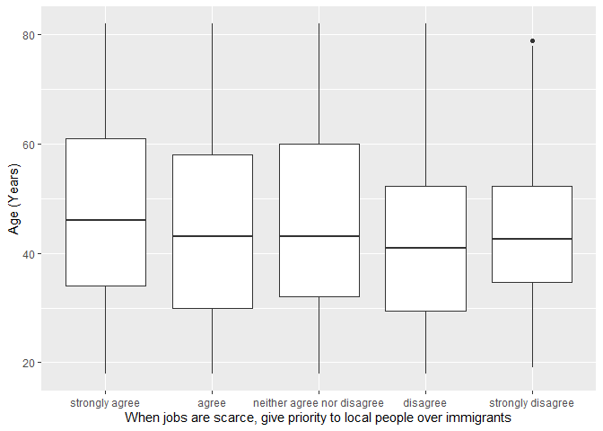

## Introduction

This is the report for the analysis on the [European Value Study (EVS) from 2017](https://search.gesis.org/research_data/ZA7500) which is a survey research program on how Europeans in Serbia think about family, work, religion, politics, and society. We are mainly interested in Europeans thoughts on two questions:

1. When a mother works for pay, do Europeans think the children suffer?
2. When jobs are scarce, do Europeans think employers should give priority to local people over immigrants?

## Descriptives of variables

In the following table, the variables are:

1. `v72` represents the first question of interest (1-strongly agree, 2-agree, 3-disagree, or 4-strongly disagree)
2. `v80` represents the second question of interest (1-strongly agree, 2-agree, 3-neither agree nor disagree, 4-disagree, or 5-strongly disagree)
3. `sex` (1-male or 2-female)
4. `age` (years)
5. `education` (1-lower, 2-medium, or 3-higher)

-----------------------------------------------
      v72             v80             age      
--------------- --------------- ---------------
 Min.  :1.000    Min.  :1.000    Min.  :18.00  

 1st Qu.:2.000   1st Qu.:1.000   1st Qu.:32.00 

 Median :3.000   Median :2.000   Median :45.00 

  Mean :2.517     Mean :1.937     Mean :45.88  

 3rd Qu.:3.000   3rd Qu.:3.000   3rd Qu.:59.00 

 Max.  :4.000    Max.  :5.000    Max.  :82.00  
-----------------------------------------------

Table: Descriptive table for continuous variables

Table: Descriptive table for categorical variables

|Education | Sex|  Freq |
|:---------|---:|:------|
|Lower     |   M|113.00 |
|Medium    |   M|353.00 |
|Higher    |   M|190.00 |
|Lower     |   F|124.00 |
|Medium    |   F|385.00 |
|Higher    |   F|254.00 |

## Graphs

Boxplot for first question of interest (v72)

Boxplot for second question of interest (v80)

## Regression Analysis

### Model: v72 ~ age + $\sqrt{\text{age}}$ + sex + education

--------------------------------------------------------------------
        &nbsp;          Estimate   Std. Error   t value   Pr(>|t|)  
---------------------- ---------- ------------ --------- -----------
   **(Intercept)**        3.54       0.6504      5.443    6.164e-08 

       **age**          0.01549      0.016      0.9679     0.3332   

    **sqrt(age)**       -0.2996      0.2096      -1.43     0.1531   

    **sex-female**       0.126      0.04488      2.808    0.005056  

 **education-medium**    0.1632     0.07134      2.288     0.02229  

 **education-higher**    0.3509     0.07949      4.415    1.088e-05 
--------------------------------------------------------------------

---------------------------------------------------------------
 Observations   Residual Std. Error    $R^2$    Adjusted $R^2$ 
-------------- --------------------- --------- ----------------
     1419             0.8416          0.05255      0.04919     
---------------------------------------------------------------

Table: Fitting linear model: v72 ~ age + sqrt(age) + sex + education

The coefficient estimate for `sex` is 0.1260134 which means that the effect of a female respondent compared to a male is positive. The corresponding $p$-value is 0.0050563 which is smaller than 0.05. Thus, `sex` is significant in the model.

### Model: v80 ~ age + $\sqrt{\text{age}}$ + sex + education

-------------------------------------------------------------------
        &nbsp;          Estimate   Std. Error   t value   Pr(>|t|) 
---------------------- ---------- ------------ --------- ----------
   **(Intercept)**       2.587       0.8059      3.21     0.001358 

       **age**          0.01092     0.01983     0.5509     0.5818  

    **sqrt(age)**       -0.1907      0.2597     -0.7344    0.4628  

    **sex-female**      0.04851     0.05561     0.8723     0.3832  

 **education-medium**   0.09213     0.08839      1.042     0.2974  

 **education-higher**    0.1467     0.09849      1.49      0.1365  
-------------------------------------------------------------------

----------------------------------------------------------------
 Observations   Residual Std. Error    $R^2$     Adjusted $R^2$ 
-------------- --------------------- ---------- ----------------
     1419              1.043          0.007004      0.00349     
----------------------------------------------------------------

Table: Fitting linear model: v80 ~ age + sqrt(age) + sex + education

The coefficient estimate for `sex` is 0.0485101 which means that the effect of a female respondent compared to a male is positive. The corresponding $p$-value is 0.3831704 which is greater than or equal to 0.05. Thus, `sex` is not significant in the model.

