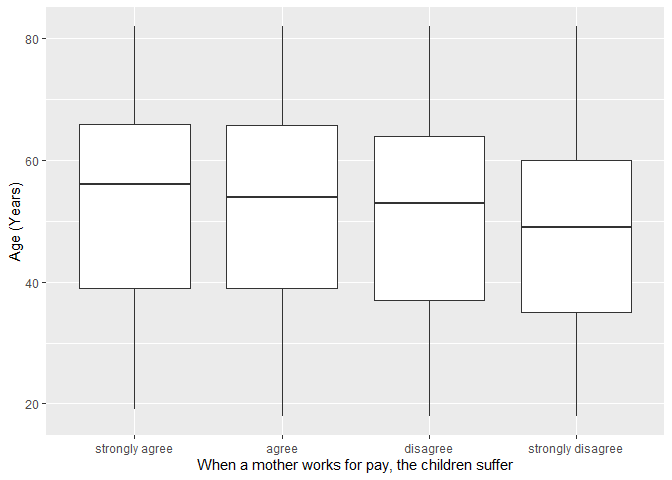
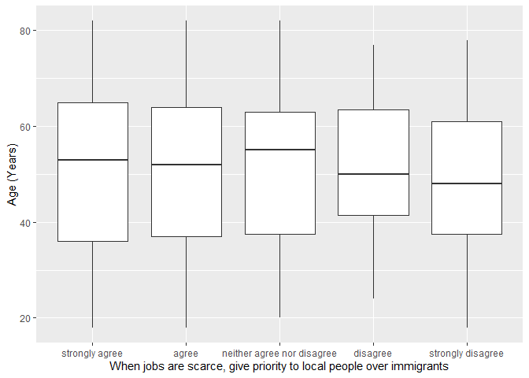

## Introduction

This is the report for the analysis on the [European Value Study (EVS) from 2017](https://search.gesis.org/research_data/ZA7500) which is a survey research program on how Europeans in Slovakia think about family, work, religion, politics, and society. We are mainly interested in Europeans thoughts on two questions:

1. When a mother works for pay, do Europeans think the children suffer?
2. When jobs are scarce, do Europeans think employers should give priority to local people over immigrants?

## Descriptives of variables

In the following table, the variables are:

1. `v72` represents the first question of interest (1-strongly agree, 2-agree, 3-disagree, or 4-strongly disagree)
2. `v80` represents the second question of interest (1-strongly agree, 2-agree, 3-neither agree nor disagree, 4-disagree, or 5-strongly disagree)
3. `sex` (1-male or 2-female)
4. `age` (years)
5. `education` (1-lower, 2-medium, or 3-higher)

-----------------------------------------------
      v72             v80             age      
--------------- --------------- ---------------
 Min.  :1.000    Min.  :1.000    Min.  :18.00  

 1st Qu.:2.000   1st Qu.:1.000   1st Qu.:37.00 

 Median :3.000   Median :1.000   Median :53.00 

  Mean :2.787     Mean :1.633     Mean :50.62  

 3rd Qu.:3.000   3rd Qu.:2.000   3rd Qu.:64.00 

 Max.  :4.000    Max.  :5.000    Max.  :82.00  
-----------------------------------------------

Table: Descriptive table for continuous variables

Table: Descriptive table for categorical variables

|Education | Sex|   Freq|
|:---------|---:|------:|
|Lower     |   M|  52.00|
|Medium    |   M| 414.00|
|Higher    |   M|  58.00|
|Lower     |   F| 115.00|
|Medium    |   F| 608.00|
|Higher    |   F| 149.00|

## Graphs

Boxplot for first question of interest (v72)

Boxplot for second question of interest (v80)

## Regression Analysis

### Model: v72 ~ age + $\sqrt{\text{age}}$ + sex + education

--------------------------------------------------------------------
        &nbsp;          Estimate   Std. Error   t value   Pr(>|t|)  
---------------------- ---------- ------------ --------- -----------
   **(Intercept)**       3.037       0.6537      4.645    3.722e-06 

       **age**          0.002109    0.01517      0.139     0.8895   

    **sqrt(age)**       -0.09125     0.2043     -0.4466    0.6552   

    **sex-female**      0.09986     0.04776      2.091     0.03674  

 **education-medium**    0.2148     0.07427      2.892    0.003883  

 **education-higher**    0.4231      0.092       4.599    4.634e-06 
--------------------------------------------------------------------

---------------------------------------------------------------
 Observations   Residual Std. Error    $R^2$    Adjusted $R^2$ 
-------------- --------------------- --------- ----------------
     1396             0.8526          0.02879       0.0253     
---------------------------------------------------------------

Table: Fitting linear model: v72 ~ age + sqrt(age) + sex + education

The coefficient estimate for `sex` is 0.0998562 which means that the effect of a female respondent compared to a male is positive. The corresponding $p$-value is 0.0367393 which is smaller than 0.05. Thus, `sex` is significant in the model.

### Model: v80 ~ age + $\sqrt{\text{age}}$ + sex + education

-------------------------------------------------------------------
        &nbsp;          Estimate   Std. Error   t value   Pr(>|t|) 
---------------------- ---------- ------------ --------- ----------
   **(Intercept)**       0.1667      0.6822     0.2443     0.807   

       **age**          -0.03257    0.01583     -2.058     0.0398  

    **sqrt(age)**        0.4457      0.2132      2.09     0.03676  

    **sex-female**      -0.01329    0.04984     -0.2667    0.7897  

 **education-medium**   0.009821     0.0775     0.1267     0.8992  

 **education-higher**   -0.0388      0.096      -0.4041    0.6862  
-------------------------------------------------------------------

----------------------------------------------------------------
 Observations   Residual Std. Error    $R^2$     Adjusted $R^2$ 
-------------- --------------------- ---------- ----------------
     1396             0.8897          0.003799     0.0002153    
----------------------------------------------------------------

Table: Fitting linear model: v80 ~ age + sqrt(age) + sex + education

The coefficient estimate for `sex` is -0.0132932 which means that the effect of a female respondent compared to a male is negative. The corresponding $p$-value is 0.7897317 which is greater than or equal to 0.05. Thus, `sex` is not significant in the model.

