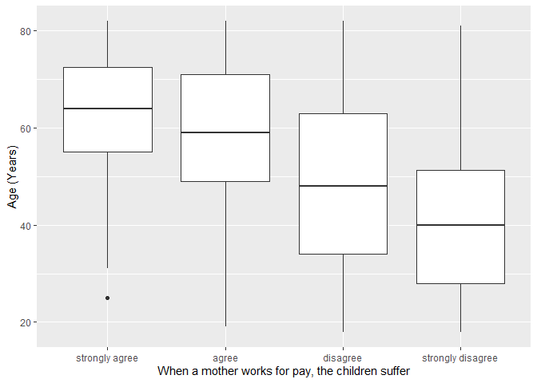
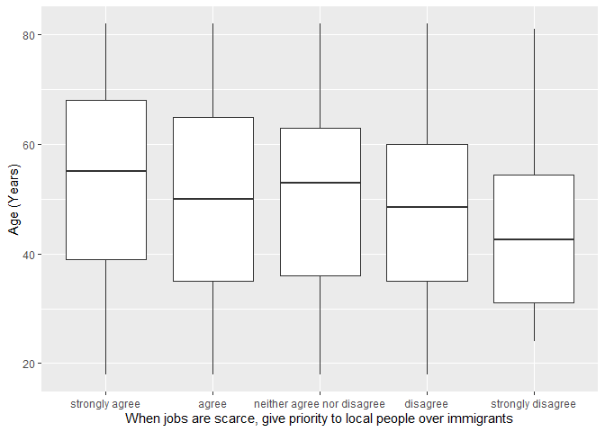

## Introduction

This is the report for the analysis on the [European Value Study (EVS) from 2017](https://search.gesis.org/research_data/ZA7500) which is a survey research program on how Europeans in Slovenia think about family, work, religion, politics, and society. We are mainly interested in Europeans thoughts on two questions:

1. When a mother works for pay, do Europeans think the children suffer?
2. When jobs are scarce, do Europeans think employers should give priority to local people over immigrants?

## Descriptives of variables

In the following table, the variables are:

1. `v72` represents the first question of interest (1-strongly agree, 2-agree, 3-disagree, or 4-strongly disagree)
2. `v80` represents the second question of interest (1-strongly agree, 2-agree, 3-neither agree nor disagree, 4-disagree, or 5-strongly disagree)
3. `sex` (1-male or 2-female)
4. `age` (years)
5. `education` (1-lower, 2-medium, or 3-higher)

----------------------------------------------
      v72             v80            age      
--------------- --------------- --------------
 Min.  :1.000    Min.  :1.000    Min.  :18.0  

 1st Qu.:2.000   1st Qu.:1.000   1st Qu.:36.0 

 Median :3.000   Median :2.000   Median :51.0 

  Mean :2.816     Mean :2.214     Mean :50.3  

 3rd Qu.:3.000   3rd Qu.:3.000   3rd Qu.:64.0 

 Max.  :4.000    Max.  :5.000    Max.  :82.0  
----------------------------------------------

Table: Descriptive table for continuous variables

Table: Descriptive table for categorical variables

|Education | Sex|   Freq|
|:---------|---:|------:|
|Lower     |   M|  53.00|
|Medium    |   M| 287.00|
|Higher    |   M| 118.00|
|Lower     |   F| 115.00|
|Medium    |   F| 270.00|
|Higher    |   F| 202.00|

## Graphs

Boxplot for first question of interest (v72)

Boxplot for second question of interest (v80)

## Regression Analysis

### Model: v72 ~ age + $\sqrt{\text{age}}$ + sex + education

---------------------------------------------------------------------
        &nbsp;          Estimate    Std. Error   t value   Pr(>|t|)  
---------------------- ----------- ------------ --------- -----------
   **(Intercept)**        3.732       0.5602      6.662    4.364e-11 

       **age**          -0.003494    0.01274     -0.2741     0.784   

    **sqrt(age)**        -0.1311      0.1725     -0.7601    0.4474   

    **sex-female**       0.1012      0.04377      2.312     0.02095  

 **education-medium**    0.04698     0.06327     0.7424      0.458   

 **education-higher**    0.2985      0.07001      4.264    2.189e-05 
---------------------------------------------------------------------

--------------------------------------------------------------
 Observations   Residual Std. Error   $R^2$    Adjusted $R^2$ 
-------------- --------------------- -------- ----------------
     1045             0.6907          0.1436       0.1395     
--------------------------------------------------------------

Table: Fitting linear model: v72 ~ age + sqrt(age) + sex + education

The coefficient estimate for `sex` is 0.1012235 which means that the effect of a female respondent compared to a male is positive. The corresponding $p$-value is 0.0209469 which is smaller than 0.05. Thus, `sex` is significant in the model.

### Model: v80 ~ age + $\sqrt{\text{age}}$ + sex + education

--------------------------------------------------------------------
        &nbsp;          Estimate   Std. Error   t value   Pr(>|t|)  
---------------------- ---------- ------------ --------- -----------
   **(Intercept)**       1.241       0.8336      1.488      0.137   

       **age**          -0.02701    0.01896     -1.424     0.1546   

    **sqrt(age)**        0.3056      0.2566      1.191     0.2341   

    **sex-female**      -0.06783    0.06514     -1.041      0.298   

 **education-medium**    0.1168     0.09415      1.241      0.215   

 **education-higher**    0.5855      0.1042      5.62     2.449e-08 
--------------------------------------------------------------------

---------------------------------------------------------------
 Observations   Residual Std. Error    $R^2$    Adjusted $R^2$ 
-------------- --------------------- --------- ----------------
     1045              1.028          0.06518      0.06069     
---------------------------------------------------------------

Table: Fitting linear model: v80 ~ age + sqrt(age) + sex + education

The coefficient estimate for `sex` is -0.0678271 which means that the effect of a female respondent compared to a male is negative. The corresponding $p$-value is 0.2979773 which is greater than or equal to 0.05. Thus, `sex` is not significant in the model.

