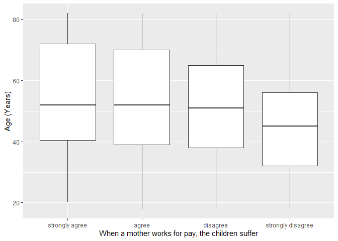
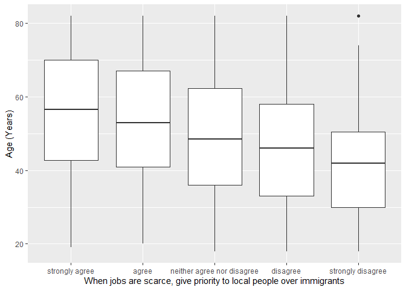

## Introduction

This is the report for the analysis on the [European Value Study (EVS) from 2017](https://search.gesis.org/research_data/ZA7500) which is a survey research program on how Europeans in Spain think about family, work, religion, politics, and society. We are mainly interested in Europeans thoughts on two questions:

1. When a mother works for pay, do Europeans think the children suffer?
2. When jobs are scarce, do Europeans think employers should give priority to local people over immigrants?

## Descriptives of variables

In the following table, the variables are:

1. `v72` represents the first question of interest (1-strongly agree, 2-agree, 3-disagree, or 4-strongly disagree)
2. `v80` represents the second question of interest (1-strongly agree, 2-agree, 3-neither agree nor disagree, 4-disagree, or 5-strongly disagree)
3. `sex` (1-male or 2-female)
4. `age` (years)
5. `education` (1-lower, 2-medium, or 3-higher)

-----------------------------------------------
      v72             v80             age      
--------------- --------------- ---------------
 Min.  :1.000    Min.  :1.000    Min.  :18.00  

 1st Qu.:2.000   1st Qu.:2.000   1st Qu.:37.00 

 Median :3.000   Median :3.000   Median :49.00 

  Mean :3.028     Mean :2.853     Mean :49.92  

 3rd Qu.:4.000   3rd Qu.:4.000   3rd Qu.:63.00 

 Max.  :4.000    Max.  :5.000    Max.  :82.00  
-----------------------------------------------

Table: Descriptive table for continuous variables

Table: Descriptive table for categorical variables

|Education | Sex|  Freq |
|:---------|---:|:------|
|Lower     |   M|257.00 |
|Medium    |   M|130.00 |
|Higher    |   M|139.00 |
|Lower     |   F|379.00 |
|Medium    |   F|147.00 |
|Higher    |   F|122.00 |

## Graphs

Boxplot for first question of interest (v72)

Boxplot for second question of interest (v80)

## Regression Analysis

### Model: v72 ~ age + $\sqrt{\text{age}}$ + sex + education

--------------------------------------------------------------------
        &nbsp;          Estimate   Std. Error   t value   Pr(>|t|)  
---------------------- ---------- ------------ --------- -----------
   **(Intercept)**       1.574       0.6876      2.29      0.02223  

       **age**          -0.03895    0.01509     -2.582    0.009952  

    **sqrt(age)**        0.4518      0.2062      2.191     0.02861  

    **sex-female**       0.1466      0.0507      2.891    0.003907  

 **education-medium**    0.3078     0.06441      4.779    1.983e-06 

 **education-higher**    0.4653     0.06642      7.005    4.15e-12  
--------------------------------------------------------------------

--------------------------------------------------------------
 Observations   Residual Std. Error   $R^2$    Adjusted $R^2$ 
-------------- --------------------- -------- ----------------
     1174              0.858          0.0892       0.0853     
--------------------------------------------------------------

Table: Fitting linear model: v72 ~ age + sqrt(age) + sex + education

The coefficient estimate for `sex` is 0.1465836 which means that the effect of a female respondent compared to a male is positive. The corresponding $p$-value is 0.0039073 which is smaller than 0.05. Thus, `sex` is significant in the model.

### Model: v80 ~ age + $\sqrt{\text{age}}$ + sex + education

---------------------------------------------------------------------
        &nbsp;          Estimate    Std. Error   t value   Pr(>|t|)  
---------------------- ----------- ------------ --------- -----------
   **(Intercept)**        3.955       1.033       3.829    0.0001353 

       **age**          -0.007151    0.02266     -0.3156    0.7524   

    **sqrt(age)**        -0.1372      0.3097     -0.4431    0.6578   

    **sex-female**      -0.02331     0.07614     -0.3061    0.7596   

 **education-medium**    0.2632      0.09673      2.721    0.006611  

 **education-higher**    0.7171      0.09975      7.189    1.16e-12  
---------------------------------------------------------------------

--------------------------------------------------------------
 Observations   Residual Std. Error   $R^2$    Adjusted $R^2$ 
-------------- --------------------- -------- ----------------
     1174              1.289          0.1158       0.112      
--------------------------------------------------------------

Table: Fitting linear model: v80 ~ age + sqrt(age) + sex + education

The coefficient estimate for `sex` is -0.0233083 which means that the effect of a female respondent compared to a male is negative. The corresponding $p$-value is 0.7595734 which is greater than or equal to 0.05. Thus, `sex` is not significant in the model.

