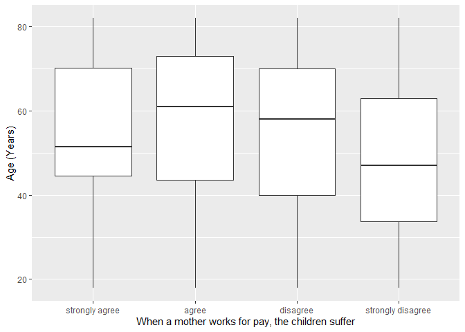
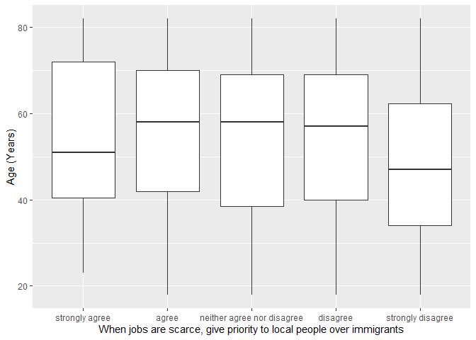

## Introduction

This is the report for the analysis on the [European Value Study (EVS) from 2017](https://search.gesis.org/research_data/ZA7500) which is a survey research program on how Europeans in Sweden think about family, work, religion, politics, and society. We are mainly interested in Europeans thoughts on two questions:

1. When a mother works for pay, do Europeans think the children suffer?
2. When jobs are scarce, do Europeans think employers should give priority to local people over immigrants?

## Descriptives of variables

In the following table, the variables are:

1. `v72` represents the first question of interest (1-strongly agree, 2-agree, 3-disagree, or 4-strongly disagree)
2. `v80` represents the second question of interest (1-strongly agree, 2-agree, 3-neither agree nor disagree, 4-disagree, or 5-strongly disagree)
3. `sex` (1-male or 2-female)
4. `age` (years)
5. `education` (1-lower, 2-medium, or 3-higher)

----------------------------------------------
      v72             v80            age      
--------------- --------------- --------------
 Min.  :1.000    Min.  :1.000    Min.  :18.0  

 1st Qu.:3.000   1st Qu.:3.000   1st Qu.:37.0 

 Median :3.000   Median :4.000   Median :54.0 

  Mean :3.312     Mean :3.956     Mean :51.9  

 3rd Qu.:4.000   3rd Qu.:5.000   3rd Qu.:67.0 

 Max.  :4.000    Max.  :5.000    Max.  :82.0  
----------------------------------------------

Table: Descriptive table for continuous variables

Table: Descriptive table for categorical variables

|Education | Sex|   Freq|
|:---------|---:|------:|
|Lower     |   M|  68.00|
|Medium    |   M| 259.00|
|Higher    |   M| 218.00|
|Lower     |   F|  77.00|
|Medium    |   F| 217.00|
|Higher    |   F| 305.00|

## Graphs

Boxplot for first question of interest (v72)

Boxplot for second question of interest (v80)

## Regression Analysis

### Model: v72 ~ age + $\sqrt{\text{age}}$ + sex + education

--------------------------------------------------------------------
        &nbsp;          Estimate   Std. Error   t value   Pr(>|t|)  
---------------------- ---------- ------------ --------- -----------
   **(Intercept)**       2.269       0.5986      3.791    0.0001576 

       **age**          -0.02754    0.01362     -2.023     0.04333  

    **sqrt(age)**        0.2854      0.1847      1.546     0.1225   

    **sex-female**       0.2326     0.04287      5.426    7.042e-08 

 **education-medium**    0.2942     0.07041      4.178    3.171e-05 

 **education-higher**    0.4494     0.07185      6.256    5.595e-10 
--------------------------------------------------------------------

--------------------------------------------------------------
 Observations   Residual Std. Error   $R^2$    Adjusted $R^2$ 
-------------- --------------------- -------- ----------------
     1144             0.7182          0.1046       0.1007     
--------------------------------------------------------------

Table: Fitting linear model: v72 ~ age + sqrt(age) + sex + education

The coefficient estimate for `sex` is 0.2325892 which means that the effect of a female respondent compared to a male is positive. The corresponding $p$-value is 7.0420532\times 10^{-8} which is smaller than 0.05. Thus, `sex` is significant in the model.

### Model: v80 ~ age + $\sqrt{\text{age}}$ + sex + education

--------------------------------------------------------------------
        &nbsp;          Estimate   Std. Error   t value   Pr(>|t|)  
---------------------- ---------- ------------ --------- -----------
   **(Intercept)**       3.199       0.8289      3.859    0.0001201 

       **age**          -0.01663    0.01885     -0.8822    0.3778   

    **sqrt(age)**        0.1539      0.2557     0.6017     0.5475   

    **sex-female**       0.2214     0.05936      3.729    0.0002016 

 **education-medium**    0.3279      0.0975      3.363    0.0007961 

 **education-higher**    0.6084     0.09949      6.116    1.321e-09 
--------------------------------------------------------------------

---------------------------------------------------------------
 Observations   Residual Std. Error    $R^2$    Adjusted $R^2$ 
-------------- --------------------- --------- ----------------
     1144             0.9945          0.07113      0.06705     
---------------------------------------------------------------

Table: Fitting linear model: v80 ~ age + sqrt(age) + sex + education

The coefficient estimate for `sex` is 0.22136 which means that the effect of a female respondent compared to a male is positive. The corresponding $p$-value is 2.0157005\times 10^{-4} which is smaller than 0.05. Thus, `sex` is significant in the model.

