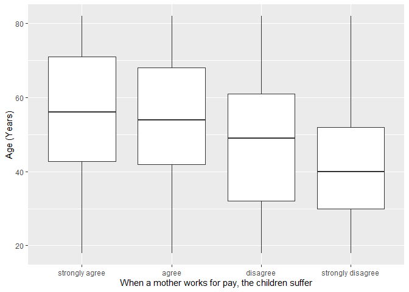
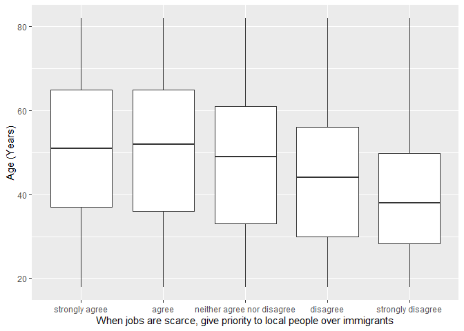

## Introduction

This is the report for the analysis on the [European Value Study (EVS) from 2017](https://search.gesis.org/research_data/ZA7500) which is a survey research program on how Europeans in Switzerland think about family, work, religion, politics, and society. We are mainly interested in Europeans thoughts on two questions:

1. When a mother works for pay, do Europeans think the children suffer?
2. When jobs are scarce, do Europeans think employers should give priority to local people over immigrants?

## Descriptives of variables

In the following table, the variables are:

1. `v72` represents the first question of interest (1-strongly agree, 2-agree, 3-disagree, or 4-strongly disagree)
2. `v80` represents the second question of interest (1-strongly agree, 2-agree, 3-neither agree nor disagree, 4-disagree, or 5-strongly disagree)
3. `sex` (1-male or 2-female)
4. `age` (years)
5. `education` (1-lower, 2-medium, or 3-higher)

-----------------------------------------------
      v72             v80             age      
--------------- --------------- ---------------
 Min.  :1.000    Min.  :1.000    Min.  :18.00  

 1st Qu.:2.000   1st Qu.:2.000   1st Qu.:34.00 

 Median :3.000   Median :2.000   Median :49.00 

  Mean :2.789     Mean :2.463     Mean :48.73  

 3rd Qu.:3.000   3rd Qu.:3.000   3rd Qu.:62.00 

 Max.  :4.000    Max.  :5.000    Max.  :82.00  
-----------------------------------------------

Table: Descriptive table for continuous variables

Table: Descriptive table for categorical variables

|Education | Sex|  Freq |
|:---------|---:|:------|
|Lower     |   M|178.00 |
|Medium    |   M|584.00 |
|Higher    |   M|693.00 |
|Lower     |   F|300.00 |
|Medium    |   F|696.00 |
|Higher    |   F|618.00 |

## Graphs

Boxplot for first question of interest (v72)

Boxplot for second question of interest (v80)

## Regression Analysis

### Model: v72 ~ age + $\sqrt{\text{age}}$ + sex + education

---------------------------------------------------------------------
        &nbsp;          Estimate    Std. Error   t value   Pr(>|t|)  
---------------------- ----------- ------------ --------- -----------
   **(Intercept)**        3.157       0.3726      8.474    3.642e-17 

       **age**          -0.002619    0.008491    -0.3084    0.7578   

    **sqrt(age)**        -0.1051      0.1144     -0.9189    0.3582   

    **sex-female**       0.2619      0.02868      9.131    1.197e-19 

 **education-medium**    0.2498      0.04274      5.843    5.666e-09 

 **education-higher**    0.5578      0.04368      12.77    2.011e-36 
---------------------------------------------------------------------

--------------------------------------------------------------
 Observations   Residual Std. Error   $R^2$    Adjusted $R^2$ 
-------------- --------------------- -------- ----------------
     3069             0.7878          0.1332       0.1318     
--------------------------------------------------------------

Table: Fitting linear model: v72 ~ age + sqrt(age) + sex + education

The coefficient estimate for `sex` is 0.2619017 which means that the effect of a female respondent compared to a male is positive. The corresponding $p$-value is 1.1974957\times 10^{-19} which is smaller than 0.05. Thus, `sex` is significant in the model.

### Model: v80 ~ age + $\sqrt{\text{age}}$ + sex + education

---------------------------------------------------------------------
        &nbsp;          Estimate    Std. Error   t value   Pr(>|t|)  
---------------------- ----------- ------------ --------- -----------
   **(Intercept)**        3.102       0.5325      5.826    6.248e-09 

       **age**          -0.004703    0.01213     -0.3876    0.6983   

    **sqrt(age)**       -0.07868      0.1635     -0.4812    0.6304   

    **sex-female**       0.09853     0.04099      2.404     0.01628  

 **education-medium**   -0.05157     0.06108     -0.8442    0.3986   

 **education-higher**    0.2328      0.06242      3.729    0.0001958 
---------------------------------------------------------------------

---------------------------------------------------------------
 Observations   Residual Std. Error    $R^2$    Adjusted $R^2$ 
-------------- --------------------- --------- ----------------
     3069              1.126          0.04265      0.04109     
---------------------------------------------------------------

Table: Fitting linear model: v80 ~ age + sqrt(age) + sex + education

The coefficient estimate for `sex` is 0.0985283 which means that the effect of a female respondent compared to a male is positive. The corresponding $p$-value is 0.0162791 which is smaller than 0.05. Thus, `sex` is significant in the model.

