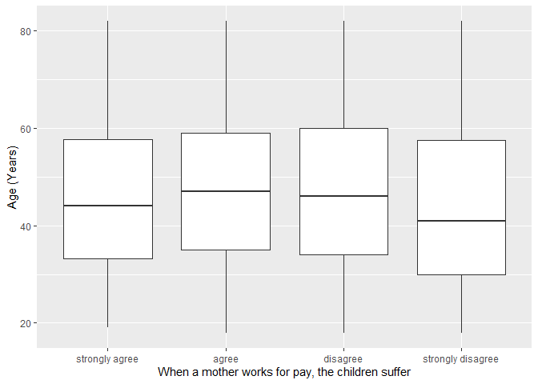
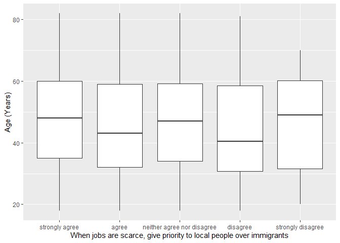

## Introduction

This is the report for the analysis on the [European Value Study (EVS) from 2017](https://search.gesis.org/research_data/ZA7500) which is a survey research program on how Europeans in Ukraine think about family, work, religion, politics, and society. We are mainly interested in Europeans thoughts on two questions:

1. When a mother works for pay, do Europeans think the children suffer?
2. When jobs are scarce, do Europeans think employers should give priority to local people over immigrants?

## Descriptives of variables

In the following table, the variables are:

1. `v72` represents the first question of interest (1-strongly agree, 2-agree, 3-disagree, or 4-strongly disagree)
2. `v80` represents the second question of interest (1-strongly agree, 2-agree, 3-neither agree nor disagree, 4-disagree, or 5-strongly disagree)
3. `sex` (1-male or 2-female)
4. `age` (years)
5. `education` (1-lower, 2-medium, or 3-higher)

-----------------------------------------------
      v72             v80             age      
--------------- --------------- ---------------
 Min.  :1.000    Min.  :1.000    Min.  :18.00  

 1st Qu.:2.000   1st Qu.:1.000   1st Qu.:33.00 

 Median :3.000   Median :2.000   Median :46.00 

  Mean :2.842     Mean :1.952     Mean :46.73  

 3rd Qu.:3.000   3rd Qu.:2.000   3rd Qu.:59.00 

 Max.  :4.000    Max.  :5.000    Max.  :82.00  
-----------------------------------------------

Table: Descriptive table for continuous variables

Table: Descriptive table for categorical variables

|Education | Sex|   Freq|
|:---------|---:|------:|
|Lower     |   M|  46.00|
|Medium    |   M| 212.00|
|Higher    |   M| 294.00|
|Lower     |   F|  96.00|
|Medium    |   F| 326.00|
|Higher    |   F| 536.00|

## Graphs

Boxplot for first question of interest (v72)

Boxplot for second question of interest (v80)

## Regression Analysis

### Model: v72 ~ age + $\sqrt{\text{age}}$ + sex + education

--------------------------------------------------------------------
        &nbsp;          Estimate   Std. Error   t value   Pr(>|t|)  
---------------------- ---------- ------------ --------- -----------
   **(Intercept)**        4.57       0.5448      8.389    1.115e-16 

       **age**          0.03858     0.01248      3.091    0.002029  

    **sqrt(age)**       -0.5389      0.167      -3.226    0.001283  

    **sex-female**      0.08271     0.04037      2.049     0.04066  

 **education-medium**   -0.01437    0.07281     -0.1973    0.8436   

 **education-higher**   0.08336     0.07054      1.182     0.2375   
--------------------------------------------------------------------

---------------------------------------------------------------
 Observations   Residual Std. Error    $R^2$    Adjusted $R^2$ 
-------------- --------------------- --------- ----------------
     1510             0.7543          0.01323      0.009949    
---------------------------------------------------------------

Table: Fitting linear model: v72 ~ age + sqrt(age) + sex + education

The coefficient estimate for `sex` is 0.082707 which means that the effect of a female respondent compared to a male is positive. The corresponding $p$-value is 0.0406553 which is smaller than 0.05. Thus, `sex` is significant in the model.

### Model: v80 ~ age + $\sqrt{\text{age}}$ + sex + education

--------------------------------------------------------------------
        &nbsp;          Estimate   Std. Error   t value   Pr(>|t|)  
---------------------- ---------- ------------ --------- -----------
   **(Intercept)**       3.212       0.7168      4.481    8.005e-06 

       **age**          0.02022     0.01642      1.232     0.2183   

    **sqrt(age)**       -0.3246      0.2198     -1.477     0.1399   

    **sex-female**      0.08224     0.05311      1.548     0.1218   

 **education-medium**   -0.1832      0.0958     -1.912     0.05601  

 **education-higher**   -0.01408    0.09281     -0.1517    0.8795   
--------------------------------------------------------------------

--------------------------------------------------------------
 Observations   Residual Std. Error   $R^2$    Adjusted $R^2$ 
-------------- --------------------- -------- ----------------
     1510             0.9924          0.0128      0.009517    
--------------------------------------------------------------

Table: Fitting linear model: v80 ~ age + sqrt(age) + sex + education

The coefficient estimate for `sex` is 0.0822395 which means that the effect of a female respondent compared to a male is positive. The corresponding $p$-value is 0.1217501 which is greater than or equal to 0.05. Thus, `sex` is not significant in the model.

